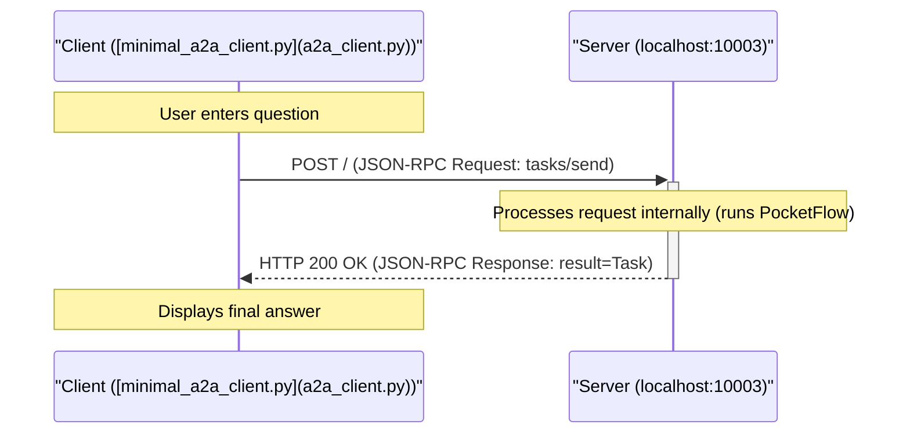

# PocketFlow Agent with A2A Protocol

本项目演示了如何将使用 PocketFlow 库构建的现有代理通过**代理间通信协议(A2A)**使其可被其他代理访问。

本实现基于教程: [A2A协议简明解释:与MCP的3个关键区别!](https://zacharyhuang.substack.com/p/a2a-protocol-simply-explained-here)

## 工作原理: A2A集成

本项目结合了两个主要部分:

1.  **PocketFlow代理逻辑:** 原始代理代码([`nodes.py`](nodes.py), [`utils.py`](utils.py), [`flow.py`](flow.py))定义了内部工作流程(决策->搜索->回答)。此代码直接取自[PocketFlow代理教程](https://github.com/The-Pocket/PocketFlow/tree/main/cookbook/pocketflow-agent)。
2.  **A2A服务器封装:** 来自[google/A2A示例仓库](https://github.com/google/A2A/tree/main/samples/python)的代码(`common/`目录)提供了必要的基础设施，将代理托管为符合A2A标准的服务器。*注:对通用服务器/客户端代码进行了少量修改，添加了详细日志记录用于教学目的。*
3.  **桥梁([`task_manager.py`](task_manager.py)):** 自定义的`PocketFlowTaskManager`类充当桥梁。它接收A2A请求(如`tasks/send`)，提取用户查询，运行PocketFlow的`agent_flow`，从流程的共享状态中获取最终结果，并将其打包回带有答案作为`Artifact`的A2A`Task`对象。

这展示了如何通过实现特定的`TaskManager`将非A2A代理框架通过A2A协议暴露出来。

## 简化交互流程



## 开始使用

### 先决条件

*   Python 3.10+(由于A2A`common`代码中使用了类型提示)
*   OpenAI API密钥

### 安装


1.  安装依赖:
    ```bash
    pip install -r requirements.txt
    ```

2. 将您的OpenAI API密钥设置为环境变量:

    ```bash
    export OPENAI_API_KEY="your-api-key-here"
    ```

    让我们快速检查一下您的API密钥是否正常工作:

    ```bash
    python utils.py
    ```
3. 从该目录运行服务器:

    ```bash
    python a2a_server.py --port 10003
    ```

    您应该会看到日志显示服务器已在`http://localhost:10003`上启动。


4.  在*单独的终端*中运行客户端 

    ```bash
    python a2a_client.py --agent-url http://localhost:10003
    ```

5.  按照客户端终端中的说明提问。输入`:q`或`quit`退出客户端。

## 示例交互日志

**(服务器日志-显示内部PocketFlow步骤)**

```
2025-04-12 17:20:40,893 - __main__ - INFO - Starting PocketFlow A2A server on http://localhost:10003
INFO:     Started server process [677223]
INFO:     Waiting for application startup.
INFO:     Application startup complete.
INFO:     Uvicorn running on http://localhost:10003 (Press CTRL+C to quit)
2025-04-12 17:20:57,647 - A2AServer - INFO - <- Received Request (ID: d3f3fb93350d47d9a94ca12bb62b656b):
{
  "jsonrpc": "2.0",
  "id": "d3f3fb93350d47d9a94ca12bb62b656b",
  "method": "tasks/send",
  "params": {
    "id": "46c3ce7b941a4fff9b8e3b644d6db5f4",
    "sessionId": "f3e12b8424c44241be881cd4bb8a269f",
    "message": {
      "role": "user",
      "parts": [
        {
          "type": "text",
          "text": "Who won the Nobel Prize in Physics 2024?"
        }
      ]
    },
    "acceptedOutputModes": [
      "text",
      "text/plain"
    ]
  }
}
2025-04-12 17:20:57,647 - task_manager - INFO - Received task send request: 46c3ce7b941a4fff9b8e3b644d6db5f4
2025-04-12 17:20:57,647 - common.server.task_manager - INFO - Upserting task 46c3ce7b941a4fff9b8e3b644d6db5f4
2025-04-12 17:20:57,647 - task_manager - INFO - Running PocketFlow for task 46c3ce7b941a4fff9b8e3b644d6db5f4...
🤔 Agent deciding what to do next...
2025-04-12 17:20:59,213 - httpx - INFO - HTTP Request: POST https://api.openai.com/v1/chat/completions "HTTP/1.1 200 OK"
🔍 Agent decided to search for: 2024 Nobel Prize in Physics winner
🌐 Searching the web for: 2024 Nobel Prize in Physics winner
2025-04-12 17:20:59,974 - primp - INFO - response: https://lite.duckduckgo.com/lite/ 200
📚 Found information, analyzing results...
🤔 Agent deciding what to do next...
2025-04-12 17:21:01,619 - httpx - INFO - HTTP Request: POST https://api.openai.com/v1/chat/completions "HTTP/1.1 200 OK"
💡 Agent decided to answer the question
✍️ Crafting final answer...
2025-04-12 17:21:03,833 - httpx - INFO - HTTP Request: POST https://api.openai.com/v1/chat/completions "HTTP/1.1 200 OK"
✅ Answer generated successfully
2025-04-12 17:21:03,834 - task_manager - INFO - PocketFlow completed for task 46c3ce7b941a4fff9b8e3b644d6db5f4
2025-04-12 17:21:03,834 - A2AServer - INFO - -> Response (ID: d3f3fb93350d47d9a94ca12bb62b656b):
{
  "jsonrpc": "2.0",
  "id": "d3f3fb93350d47d9a94ca12bb62b656b",
  "result": {
    "id": "46c3ce7b941a4fff9b8e3b644d6db5f4",
    "sessionId": "f3e12b8424c44241be881cd4bb8a269f",
    "status": {
      "state": "completed",
      "timestamp": "2025-04-12T17:21:03.834542"
    },
    "artifacts": [
      {
        "parts": [
          {
            "type": "text",
            "text": "The 2024 Nobel Prize in Physics was awarded to John J. Hopfield and Geoffrey Hinton for their foundational discoveries and inventions that have significantly advanced the field of machine learning through the use of artificial neural networks. Their pioneering work has been crucial in the development and implementation of algorithms that enable machines to learn and process information in a manner that mimics human cognitive functions. This advancement in artificial intelligence technology has had a profound impact on numerous industries, facilitating innovations across various applications, from image and speech recognition to self-driving cars."
          }
        ],
        "index": 0
      }
    ],
    "history": []
  }
}
```

**(客户端日志-显示请求/响应)**

```
Connecting to agent at: http://localhost:10003
Using Session ID: f3e12b8424c44241be881cd4bb8a269f

Enter your question (:q or quit to exit) > Who won the Nobel Prize in Physics 2024?
Sending task 46c3ce7b941a4fff9b8e3b644d6db5f4...
2025-04-12 17:20:57,643 - A2AClient - INFO - -> Sending Request (ID: d3f3fb93350d47d9a94ca12bb62b656b, Method: tasks/send):
{
  "jsonrpc": "2.0",
  "id": "d3f3fb93350d47d9a94ca12bb62b656b",
  "method": "tasks/send",
  "params": {
    "id": "46c3ce7b941a4fff9b8e3b644d6db5f4",
    "sessionId": "f3e12b8424c44241be881cd4bb8a269f",
    "message": {
      "role": "user",
      "parts": [
        {
          "type": "text",
          "text": "Who won the Nobel Prize in Physics 2024?"
        }
      ]
    },
    "acceptedOutputModes": [
      "text",
      "text/plain"
    ]
  }
}
2025-04-12 17:21:03,835 - httpx - INFO - HTTP Request: POST http://localhost:10003 "HTTP/1.1 200 OK"
2025-04-12 17:21:03,836 - A2AClient - INFO - <- Received HTTP Status 200 for Request (ID: d3f3fb93350d47d9a94ca12bb62b656b)
2025-04-12 17:21:03,836 - A2AClient - INFO - <- Received Success Response (ID: d3f3fb93350d47d9a94ca12bb62b656b):
{
  "jsonrpc": "2.0",
  "id": "d3f3fb93350d47d9a94ca12bb62b656b",
  "result": {
    "id": "46c3ce7b941a4fff9b8e3b644d6db5f4",
    "sessionId": "f3e12b8424c44241be881cd4bb8a269f",
    "status": {
      "state": "completed",
      "timestamp": "2025-04-12T17:21:03.834542"
    },
    "artifacts": [
      {
        "parts": [
          {
            "type": "text",
            "text": "The 2024 Nobel Prize in Physics was awarded to John J. Hopfield and Geoffrey Hinton for their foundational discoveries and inventions that have significantly advanced the field of machine learning through the use of artificial neural networks. Their pioneering work has been crucial in the development and implementation of algorithms that enable machines to learn and process information in a manner that mimics human cognitive functions. This advancement in artificial intelligence technology has had a profound impact on numerous industries, facilitating innovations across various applications, from image and speech recognition to self-driving cars."
          }
        ],
        "index": 0
      }
    ],
    "history": []
  }
}
Task 46c3ce7b941a4fff9b8e3b644d6db5f4 finished with state: completed

Agent Response:
The 2024 Nobel Prize in Physics was awarded to John J. Hopfield and Geoffrey Hinton for their foundational discoveries and inventions that have significantly advanced the field of machine learning through the use of artificial neural networks. Their pioneering work has been crucial in the development and implementation of algorithms that enable machines to learn and process information in a manner that mimics human cognitive functions. This advancement in artificial intelligence technology has had a profound impact on numerous industries, facilitating innovations across various applications, from image and speech recognition to self-driving cars.
```

## 关键A2A集成点

为了使PocketFlow代理兼容A2A，以下内容至关重要:

1.  **A2A服务器([`common/server/server.py`](common/server/server.py)):** 一个ASGI应用程序(使用Starlette/Uvicorn)，监听HTTP POST请求，解析JSON-RPC，并根据`method`字段路由请求。
2.  **A2A数据类型([`common/types.py`](common/types.py)):** 定义A2A消息、任务、工件、错误和代理卡结构的Pydantic模型，确保符合`a2a.json`规范。
3.  **任务管理器([`task_manager.py`](task_manager.py)):** 继承自通用`InMemoryTaskManager`的自定义类(`PocketFlowTaskManager`)。其主要作用是实现`on_send_task`方法(如果支持流式传输，还可能实现`on_send_task_subscribe`等方法)。该方法:
    *   接收经过验证的A2A`SendTaskRequest`。
    *   从请求的`message`中提取用户查询(`TextPart`)。
    *   初始化PocketFlow`shared_data`字典。
    *   创建并运行PocketFlow`agent_flow`。
    *   在流程完成后从`shared_data`字典中检索最终答案。
    *   在`InMemoryTaskManager`的存储中更新任务状态(例如，设置为`COMPLETED`或`FAILED`)。
    *   将最终答案打包成包含`TextPart`的A2A`Artifact`。
    *   为响应构造最终的A2A`Task`对象。
4.  **代理卡([`a2a_server.py`](a2a_server.py)):** 定义代理元数据(名称、描述、URL、能力、技能)的Pydantic模型(`AgentCard`)，在`/.well-known/agent.json`提供服务。
5.  **服务器入口点([`a2a_server.py`](a2a_server.py)):** 初始化`AgentCard`、`PocketFlowTaskManager`和`A2AServer`，然后启动Uvicorn服务器进程的脚本。
