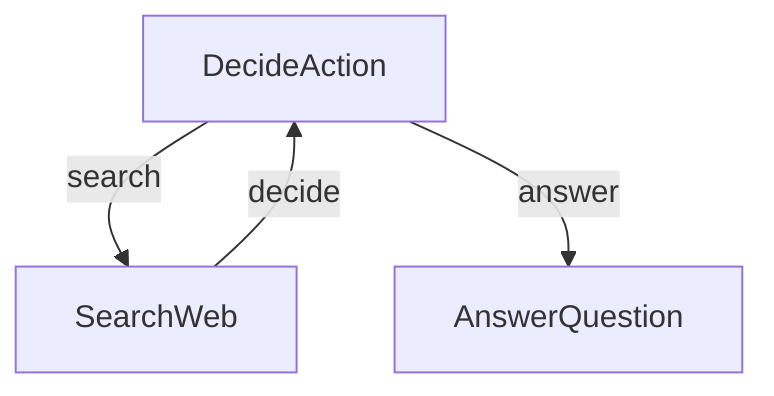

# 研究代理

本项目展示了一个简单而强大的由LLM驱动的研究代理。此实现直接基于教程：[LLM Agents are simply Graph — Tutorial For Dummies](https://zacharyhuang.substack.com/p/llm-agent-internal-as-a-graph-tutorial)。

👉 在浏览器中运行教程：[尝试 Google Colab Notebook](
https://colab.research.google.com/github/The-Pocket/PocketFlow/blob/main/cookbook/pocketflow-agent/demo.ipynb)

## 特性

- 执行网络搜索以收集信息
- 决定何时搜索以及何时回答
- 根据研究结果生成全面的答案

## 入门

1. 使用此简单命令安装所需的包：
```bash
pip install -r requirements.txt
```

2. 准备好您的OpenAI API密钥：

```bash
export OPENAI_API_KEY="your-api-key-here"
```

3. 快速检查您的API密钥是否正常工作：

```bash
python utils.py
```

这将测试LLM调用和网络搜索功能。如果您看到响应，就可以开始了！

4. 使用默认问题（关于诺贝尔奖得主）尝试代理：

```bash
python main.py
```

5. 有一个紧迫的问题？使用 `--` 前缀提出您想问的任何问题：

```bash
python main.py --"什么是量子计算？"
```

## 工作原理？

其魔力通过一个简单而强大的图结构实现，包含三个主要部分：



每个部分的作用如下：
1. **DecideAction**：决定是搜索还是回答的大脑
2. **SearchWeb**：负责外出查找信息的研究员
3. **AnswerQuestion**：负责撰写最终答案的作者

每个文件中的内容：
- [`main.py`](./main.py)：起点 - 运行整个流程！
- [`flow.py`](./flow.py)：将所有内容连接成一个智能代理
- [`nodes.py`](./nodes.py)：构成决策和执行动作的构建块
- [`utils.py`](./utils.py)：用于与LLM对话和网络搜索的辅助函数
