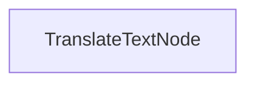

# Batch Translation Process

本项目演示了批处理实现，使LLM能够同时将文档翻译成多种语言。它旨在高效处理Markdown文件的翻译，同时保留格式。

## 特性

- 并行翻译Markdown内容到多种语言
- 将翻译后的文件保存到指定的输出目录

## 开始使用

1. 安装所需软件包:
```bash
pip install -r requirements.txt
```

2. 设置您的API密钥:
```bash
export ANTHROPIC_API_KEY="your-api-key-here"
```

3. 运行翻译过程:
```bash
python main.py
```

## 工作原理

该实现使用`TranslateTextNode`来处理批量的翻译请求:



`TranslateTextNode`:
1. 为多种语言翻译准备批次
2. 使用模型并行执行翻译
3. 将翻译后的内容保存到单独的文件
4. 保持原始Markdown结构

这种方法展示了PocketFlow如何高效地并行处理多个相关任务。

## 示例输出

当您运行翻译过程时，您将看到类似以下的输出:

```
Translated Chinese text
Translated Spanish text
Translated Japanese text
Translated German text
Translated Russian text
Translated Portuguese text
Translated French text
Translated Korean text
Saved translation to translations/README_CHINESE.md
Saved translation to translations/README_SPANISH.md
Saved translation to translations/README_JAPANESE.md
Saved translation to translations/README_GERMAN.md
Saved translation to translations/README_RUSSIAN.md
Saved translation to translations/README_PORTUGUESE.md
Saved translation to translations/README_FRENCH.md
Saved translation to translations/README_KOREAN.md

=== Translation Complete ===
Translations saved to: translations
============================
```

## 文件

- [`main.py`](./main.py): 批处理翻译节点的实现
- [`utils.py`](./utils.py): 调用Anthropic模型的简单封装
- [`requirements.txt`](./requirements.txt): 项目依赖

翻译文件保存到`translations`目录，每个文件根据目标语言命名。