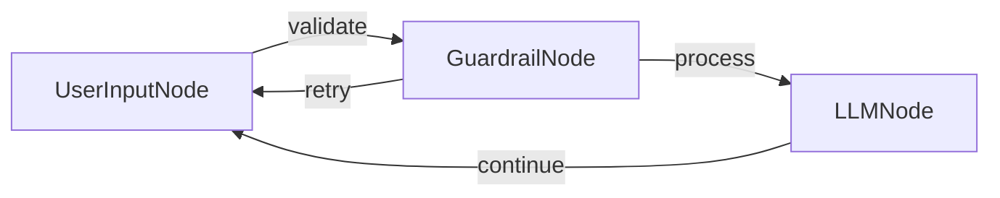

# 带护栏的旅行顾问聊天

一个使用 PocketFlow 和 OpenAI 的 GPT-4o 模型，并增强了输入验证功能的旅行主题聊天应用程序，以确保只处理与旅行相关的查询。

## 特性

- 旅行顾问聊天机器人，回答有关目的地、规划、住宿等方面的问题。
- **主题特定护栏**，确保只接受与旅行相关的查询。

## 运行方式

1. 确保您的 OpenAI API 密钥已设置：
    ```bash
    export OPENAI_API_KEY="your-api-key-here"
    ```
    或者，您可以直接编辑 `utils.py` 文件以包含您的 API 密钥。

2. 安装依赖并运行应用程序：
    ```bash
    pip install -r requirements.txt
    python main.py
    ```

## 工作原理



聊天应用程序使用：
- 一个 `UserInputNode`，在其 `exec` 方法中收集用户输入。
- 一个 `GuardrailNode`，使用以下方法验证查询是否与旅行相关：
  - 基本验证检查（空输入、过短）。
  - 基于 LLM 的验证，以确定查询是否与旅行相关。
- 一个 `LLMNode`，使用 GPT-4o 和旅行顾问系统提示处理有效的旅行查询。
- 流程连接，在处理前通过验证路由输入，并处理与旅行无关查询的重试。

## 文件

- [`main.py`](./main.py)：节点和聊天流程的实现。
- [`utils.py`](./utils.py)：调用 OpenAI API 的实用程序。

## 示例输出

``` 
欢迎使用旅行顾问聊天！输入'exit'结束对话。

你: 计划我的泰国之旅

旅行顾问: 泰国融合了充满活力的城市、宁静的海滩和丰富的文化。从曼谷开始，探索大皇宫和当地市场。向北前往清迈，参观寺庙和大象保护区。向南飞往岛屿；普吉岛或苏梅岛，享受海滩、潜水和夜生活。考虑在凉爽季节（11月至2月）前往，天气宜人。住宿范围从经济型旅馆到豪华度假村。国内航班、火车和巴士连接主要目的地。不要错过当地美食，从街头小吃到高级餐饮。确保您的护照有效期为六个月，并考虑购买旅行保险以安心。祝您旅途愉快！

你: exit

再见！旅途愉快！
```

```
欢迎使用旅行顾问聊天！输入'exit'结束对话。

你: 如何学习大型语言模型？

旅行顾问: 该查询与旅行建议、目的地、规划或其他旅行主题无关。它是关于学习大型语言模型，这是一个与人工智能和机器学习相关的主题。

你: exit

再见！旅途愉快！
```