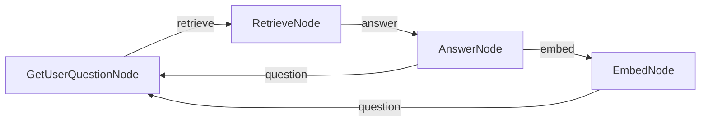

# PocketFlow Chat with Memory

一个使用 PocketFlow 实现记忆检索的聊天应用。此示例维护一个最近对话的滑动窗口，同时根据上下文检索相关的历史对话。

此实现直接基于教程：[从零开始构建 AI 代理记忆 — 傻瓜式教程](https://zacharyhuang.substack.com/p/build-ai-agent-memory-from-scratch)。

## 特性

- 维护一个包含 3 对最新对话的窗口
- 使用嵌入归档旧对话
- 使用向量相似度检索最相关的历史对话
- 结合最新上下文（3 对）和检索到的上下文（1 对）以获得更好的响应

## 运行

1. 确保您的 OpenAI API 密钥已设置：
    ```bash
    export OPENAI_API_KEY="your-api-key-here"
    ```

2. 安装依赖并运行应用程序：
    ```bash
    pip install -r requirements.txt
    python main.py
    ```
    
## 工作原理



聊天应用程序使用：
- 四个专门的节点：
  - `GetUserQuestionNode`：处理交互式用户输入
  - `RetrieveNode`：使用向量相似度查找相关的历史对话
  - `AnswerNode`：使用最新和检索到的上下文生成响应
  - `EmbedNode`：使用嵌入归档旧对话
- 一种滑动窗口方法，仅在活动上下文中维护 3 对最新对话

## 文件

- [`nodes.py`](./nodes.py)：四个节点实现，职责分离清晰
- [`flow.py`](./flow.py)：聊天流程结构定义
- [`main.py`](./main.py)：运行演示的入口点
- [`utils/`](./utils/)：用于嵌入、LLM 调用和向量操作的实用函数


## 示例输出

```
==================================================
PocketFlow Chat with Memory
==================================================
此聊天保留您最近的 3 次对话
并在需要时带回相关的历史对话
输入 'exit' 结束对话
==================================================
欢迎来到交互式聊天！输入 'exit' 结束对话。

你：记住，我的猫叫 Whiskers，她只喝流动的水龙头里的水

助手：明白了！Whiskers 只喝流动水龙头里的水。如果您有任何关于她的问题或需要建议，请随时提问！

你：记住，我对花生过敏，但吃杏仁和腰果没问题

助手：明白了！您对花生过敏，但可以安全食用杏仁和腰果。如果您需要任何与您的饮食偏好或限制相关的帮助或信息，请告诉我！

你：记住，我的周年纪念日是 6 月 17 日，我总是直到最后一刻才记得买礼物

助手：明白了！您的周年纪念日是 6 月 17 日，您经常在最后一刻才想起买礼物。如果您愿意，我可以帮助您集思广益寻找礼物创意或在日期临近时设置提醒！

你：记住，我小时候在葡萄牙住了 3 年，现在还会说一些葡萄牙语

助手：很高兴知道！您小时候在葡萄牙住了三年，现在还会说一些葡萄牙语。如果您想练习或需要任何与葡萄牙语或文化相关的帮助，请随时提问！
✅ 对话已添加到索引位置 0
✅ 索引现在包含 1 条对话

你：记住，我最喜欢的甜点是提拉米苏，但前提是它必须用真正的马斯卡彭芝士制作
🔍 正在查找相关对话：记住，我最喜欢的甜点 ...
📄 已检索到对话（距离：0.5008）

助手：明白了！您最喜欢的甜点是提拉米苏，但前提是它必须用真正的马斯卡彭芝士制作。如果您需要任何推荐或食谱，请告诉我！
✅ 对话已添加到索引位置 1
✅ 索引现在包含 2 条对话

你：记住，我收藏老式机械表，我最有价值的是一块 1965 年的欧米茄海马表
🔍 正在查找相关对话：记住，我收藏老式机械表...
📄 已检索到对话（距离：0.5374）

助手：明白了！您收藏老式机械表，您最有价值的是一块 1965 年的欧米茄海马表。如果您有关于手表的问题或需要收藏方面的帮助，请随时联系！
✅ 对话已添加到索引位置 2
✅ 索引现在包含 3 条对话

你：我的猫叫什么名字？
🔍 正在查找相关对话：我的猫叫什么名字？...
📄 已检索到对话（距离：0.3643）

助手：您的猫叫 Whiskers。
✅ 对话已添加到索引位置 3
✅ 索引现在包含 4 条对话
```
