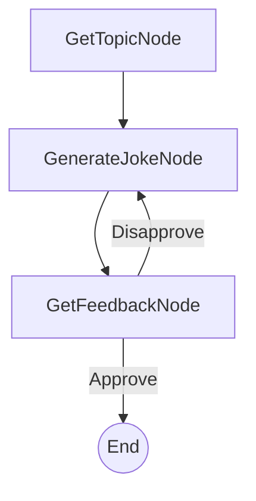

# PocketFlow Command-Line Joke Generator (Human-in-the-Loop Example)

一个简单、交互式的命令行应用程序，根据用户提供的主题和直接的人工反馈生成笑话。这作为由 PocketFlow 编排的人机协作 (HITL) 工作流的一个清晰示例。

## 特性

- **交互式笑话生成**：询问任何主题的笑话。
- **人机协作反馈**：不喜欢一个笑话？您的反馈直接影响下一次生成尝试。
- **极简设计**：使用 PocketFlow 进行 HITL 任务的直接示例。
- **由 LLM 提供支持**：（通过 API 调用 Anthropic Claude 进行笑话生成）。

## 入门

该项目是 PocketFlow 食谱示例的一部分。假设您已经克隆了 [PocketFlow 仓库](https://github.com/ssvip9527/PocketFlow) 并且位于 `cookbook/pocketflow-cli-hitl` 目录中。

1.  **安装所需依赖**：
    ```bash
    pip install -r requirements.txt
    ```

2.  **设置您的 Anthropic API 密钥**：
    该应用程序使用 Anthropic Claude 生成笑话。您需要将您的 API 密钥设置为环境变量。
    ```bash
    export ANTHROPIC_API_KEY="your-anthropic-api-key-here"
    ```
    您可以通过直接运行 `call_llm.py` 实用程序来测试它是否正常工作：
    ```bash
    python utils/call_llm.py
    ```

3.  **运行笑话生成器**：
    ```bash
    python main.py
    ```

## 工作原理

该系统使用一个简单的 PocketFlow 工作流：



1.  **GetTopicNode**：提示用户输入笑话的主题。
2.  **GenerateJokeNode**：将主题（以及任何先前不喜欢的笑话作为上下文）发送给 LLM 以生成新笑话。
3.  **GetFeedbackNode**：向用户展示笑话并询问他们是否喜欢。
    *   如果**是**（批准），应用程序结束。
    *   如果**否**（不批准），则记录不喜欢的笑话，并且流程循环回 `GenerateJokeNode` 再次尝试。

## 示例输出

以下是与笑话生成器交互的示例：

```
欢迎使用命令行笑话生成器！
您想听什么主题的笑话？ Pocket Flow：100 行 LLM 框架

笑话：Pocket Flow：终于，一个可以装进口袋的 LLM 框架！可惜你的模型仍然需要一个数据中心。
您喜欢这个笑话吗？(是/否): 否
好的，我再试一个。

笑话：Pocket Flow：一个 100 行的 LLM 框架，其中 99 行是导入，最后一行是 `print("TODO: implement intelligence")`。
您喜欢这个笑话吗？(是/否): 是
太棒了！很高兴您喜欢它。

感谢使用笑话生成器！
```

## 文件

-   [`main.py`](./main.py)：应用程序的入口点。
-   [`flow.py`](./flow.py)：定义 PocketFlow 图和节点连接。
-   [`nodes.py`](./nodes.py)：包含 `GetTopicNode`、`GenerateJokeNode` 和 `GetFeedbackNode` 的定义。
-   [`utils/call_llm.py`](./utils/call_llm.py)：与 LLM (Anthropic Claude) 交互的实用函数。
-   [`requirements.txt`](./requirements.txt)：列出项目依赖项。
-   [`docs/design.md`](./docs/design.md)：此应用程序的设计文档。