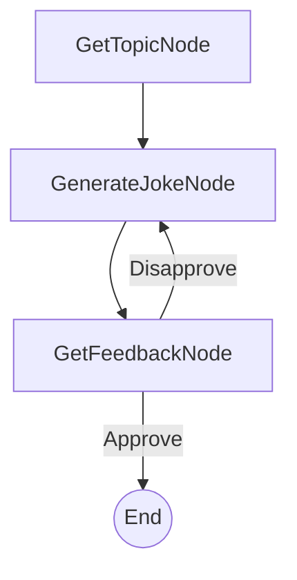

# 设计文档：命令行笑话生成器

> 请勿删除 AI 备注

## 需求

> AI 备注：保持简洁明了。
> 如果需求抽象，请编写具体的用例。

该系统将是一个命令行应用程序，它将：
1. 向用户询问笑话的主题。
2. 根据提供的主题生成笑话。
3. 询问用户是否认可该笑话。
4. 如果用户认可，应用程序可以结束或提供生成另一个笑话（为简单起见，我们暂时结束）。
5. 如果用户不认可，应用程序应：
    a. 记录用户不喜欢上一个笑话。
    b. 生成一个关于同一主题的新笑话，尝试使其与不喜欢的笑话不同。
    c. 重复步骤 3。

## 流程设计

> AI 备注：
> 1. 考虑代理、Map-Reduce、RAG 和工作流的设计模式。如果适用，请应用它们。
> 2. 提供工作流的简洁、高级描述。

### 适用设计模式：

**代理**：系统充当与用户交互的代理。它接收用户输入（主题、反馈），执行操作（生成笑话），然后根据用户反馈决定下一步（结束或尝试生成另一个笑话）。这种生成和反馈的迭代过程符合代理模式。

### 流程高级设计：

1.  **GetTopicNode**：提示用户输入笑话的主题。
2.  **GenerateJokeNode**：根据主题和任何先前的反馈生成笑话。
3.  **GetFeedbackNode**：向用户展示笑话并征求批准。根据反馈，它要么转换到结束流程，要么返回到 `GenerateJokeNode`。


## 实用函数

> AI 备注：
> 1. 通过查阅文档彻底理解实用函数定义。
> 2. 仅包含必要的实用函数，基于流程中的节点。

1.  **调用 LLM** (`utils/call_llm.py`)
    *   *输入*：`prompt` (str)，可能包含上下文，例如之前不喜欢的笑话。
    *   *输出*：`response` (str) - 生成的笑话。
    *   *必要性*：由 `GenerateJokeNode` 用于生成笑话。

## 节点设计

### 共享存储

> AI 备注：尽量减少数据冗余

共享存储结构如下：

```python
shared = {
    "topic": None,             # 存储用户提供的笑话主题
    "current_joke": None,      # 存储最新生成的笑话
    "disliked_jokes": [],    # 存储用户不喜欢的笑话列表，用于上下文
    "user_feedback": None      # 存储用户的最新反馈（例如，“approve”，“disapprove”）
}
```

### 节点步骤

> AI 备注：仔细决定是否使用批处理/异步节点/流。

1.  **GetTopicNode**
    *   *目的*：从用户那里获取所需的笑话主题。
    *   *类型*：常规
    *   *步骤*：
        *   `prep`：（第一次运行不需要，或者如果我们循环以获取新主题，可以检查主题是否已存在）
        *   `exec`：通过 `input()` 提示用户输入笑话主题。
        *   `post`：将用户输入的主题存储到 `shared["topic"]` 中。返回 `"default"` 操作以继续到 `GenerateJokeNode`。

2.  **GenerateJokeNode**
    *   *目的*：根据主题和任何先前不喜欢的笑话，使用 LLM 生成笑话。
    *   *类型*：常规
    *   *步骤*：
        *   `prep`：读取 `shared["topic"]` 和 `shared["disliked_jokes"]`。为 LLM 构建提示，包括主题和类似“用户不喜欢以下笑话：[不喜欢笑话列表]。请生成一个关于 [主题] 的新的、不同的笑话。”的消息。
        *   `exec`：使用准备好的提示调用 `call_llm` 实用函数。
        *   `post`：将生成的笑话存储在 `shared["current_joke"]` 中。将笑话打印到控制台。返回 `"default"` 操作以继续到 `GetFeedbackNode`。

3.  **GetFeedbackNode**
    *   *目的*：获取用户对生成的笑话的反馈并决定下一步。
    *   *类型*：常规
    *   *步骤*：
        *   `prep`：读取 `shared["current_joke"]`。
        *   `exec`：提示用户（例如，“你喜欢这个笑话吗？（是/否）或（认可/不认可）：”）。获取用户输入。
        *   `post`：
            *   如果用户输入表示认可（例如，“yes”，“approve”）:
                *   将“approve”存储在 `shared["user_feedback"]` 中。
                *   返回 `"Approve"` 操作（导致流程终止或感谢消息）。
            *   如果用户输入表示不认可（例如，“no”，“disapprove”）:
                *   将“disapprove”存储在 `shared["user_feedback"]` 中。
                *   将 `shared["current_joke"]` 添加到 `shared["disliked_jokes"]` 列表中。
                *   返回 `"Disapprove"` 操作（返回到 `GenerateJokeNode`）。
