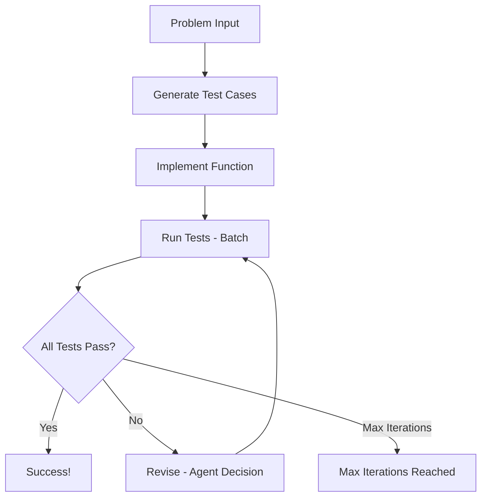

# PocketFlow Code Generator

一个智能 AI 系统，它接收 LeetCode 风格的编程问题，并自动生成全面的测试用例，实现解决方案，并迭代改进它们，直到所有测试通过。

- 查看 [Substack 教程](https://pocketflow.substack.com/p/build-your-own-ai-code-generator) 了解更多！

## 特性

- **自动测试用例生成**: 创建包括边缘情况在内的多样化测试用例
- **智能代码实现**: 生成具有适当算法的 `run_code` 函数
- **迭代改进**: 分析失败并决定是修改测试还是代码
- **丰富的调试输出**: 详细的进度跟踪和验证

## 快速开始

1. 安装所需依赖:
```bash
pip install -r requirements.txt
```

2. 设置你的 Anthropic API 密钥:
    ```bash
    export ANTHROPIC_API_KEY="your-api-key-here"
    ```
    测试你的 API 密钥是否有效:
    ```bash
    python utils/call_llm.py
    ```

3. 使用默认的 Two Sum 问题运行代码生成器:
```bash
python main.py
```

4. 或者提供你自己的问题:
```bash
python main.py "反转链表。给定一个单链表的头节点，反转链表并返回反转后的链表。"
```

## 工作原理

该系统遵循结合了 **Agent** 和 **Workflow** 设计模式的智能工作流:



### 流程

1. **GenerateTestCases**: 根据问题描述创建 5-7 个全面的测试用例
2. **ImplementFunction**: 根据问题和测试用例编写 `run_code` 函数
3. **RunTests**: 使用批处理对所有测试用例执行函数
4. **Revise**: 分析失败并做出智能决策以修改测试用例和/或函数代码
5. **Loop**: 继续循环直到所有测试通过或达到最大迭代次数

## 示例输出

以下是运行 Two Sum 示例时你将看到的内容:

```
Starting PocketFlow Code Generator...

=== 生成 7 个测试用例 ===
1. 基本情况 - 解决方案在开头
   输入: {'nums': [2, 7, 11, 15], 'target': 9}
   预期: [0, 1]
2. 基本情况 - 解决方案在中间
   输入: {'nums': [3, 2, 4], 'target': 6}
   预期: [1, 2]
3. 边缘情况 - 带有重复项的最小数组大小
   输入: {'nums': [3, 3], 'target': 6}
   预期: [0, 1]
4. 带有负数的情况
   输入: {'nums': [-1, -2, -3, -4, -5], 'target': -8}
   预期: [2, 4]
5. 带有零和负目标的情况
   输入: {'nums': [0, 4, 3, 0], 'target': 0}
   预期: [0, 3]
6. 解决方案在末尾的情况
   输入: {'nums': [1, 2, 3, 4, 5, 6], 'target': 11}
   预期: [4, 5]
7. 较大数组的情况
   输入: {'nums': [5, 75, 25, 45, 42, 2, 11, 9, 55, 12], 'target': 14}
   预期: [2, 6]

=== 实现函数 ===
def run_code(nums, target):
    # 用于存储数字 -> 索引映射的字典
    num_to_index = {}
    
    # 遍历数组
    for i, num in enumerate(nums):
        # 计算我们需要达到目标的数字
        complement = target - num
        
        # 检查映射中是否存在补数
        if complement in num_to_index:
            # 找到配对！返回索引
            return [num_to_index[complement], i]
        
        # 存储当前数字及其索引
        num_to_index[num] = i
    
    # 在给定问题约束下不应到达此处
    return []

=== 测试结果: 6/7 通过 ===
失败的测试:
1. 较大数组的情况:
   错误: 预期 [2, 6], 得到 [0, 7]
   预期: [2, 6]

=== 修订 (迭代 1) ===
修订测试用例:
  测试 7: '较大数组的情况' -> '较大数组的情况'
    旧输入: {'nums': [5, 75, 25, 45, 42, 2, 11, 9, 55, 12], 'target': 14}
    新输入: {'nums': [5, 75, 25, 45, 42, 2, 11, 9, 55, 12], 'target': 14}
    旧预期: [2, 6]
    新预期: [0, 7]

=== 测试结果: 7/7 通过 ===
```

## 关键特性

### 智能决策
**Revise** 节点充当一个代理，分析测试失败并决定是否:
- 修复测试用例 (如果它们的预期输出不正确)
- 修复函数实现 (如果逻辑错误)
- 或两者兼有

### 带有验证的结构化输出
所有 LLM 交互都使用 YAML 格式，并包含:
- **推理字段**: 透明的决策过程
- **验证断言**: 确保输出与预期结构匹配
- **丰富的调试**: 全面的步骤日志记录

### 批处理
**RunTests** 节点使用 PocketFlow 的 BatchNode 来高效地并行测试所有测试用例的函数。

## 文件

- [`main.py`](./main.py): 带有 Two Sum 示例问题的入口点
- [`flow.py`](./flow.py): 将所有节点连接到完整的工作流中
- [`nodes.py`](./nodes.py): 带有验证和调试的核心逻辑节点
- [`utils/call_llm.py`](./utils/call_llm.py): Anthropic Claude API 包装器
- [`utils/code_executor.py`](./utils/code_executor.py): 安全的 Python 代码执行工具
- [`doc/design.md`](./doc/design.md): 详细的系统设计文档

## 使用的设计模式

- **[工作流](https://the-pocket.github.io/PocketFlow/design_pattern/workflow.html)**: 测试生成 → 编码 → 测试的顺序步骤
- **[代理](https://the-pocket.github.io/PocketFlow/design_pattern/agent.html)**: 测试失败时的智能决策
- **[批处理](https://the-pocket.github.io/PocketFlow/core_abstraction/batch.html)**: 高效的并行测试执行
- **[结构化输出](https://the-pocket.github.io/PocketFlow/design_pattern/structure.html)**: 用于可靠 LLM 输出的 YAML 验证
