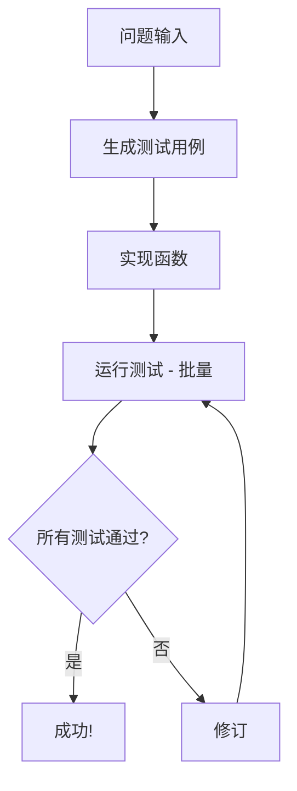

# 设计文档: PocketFlow 代码生成器

> 请勿删除 AI 备注

## 需求

> AI 备注: 保持简洁明了。
> 如果需求是抽象的，请编写具体的用户故事

**用户故事**: 作为一名开发者，我希望有一个 AI 系统，能够接收 LeetCode 风格的编程问题，并自动完成以下任务:
1. 生成包含边缘情况的全面测试用例
2. 实现解决方案函数
3. 根据测试用例测试实现
4. 当测试失败时，智能地决定是修改测试用例还是修改函数
5. 迭代直到所有测试通过

**示例问题**: 两数之和 - 给定一个整数数组和一个目标值，返回数组中两个数字的索引，使它们的和等于目标值。

这非常适合 AI，因为:
- ✅ 例行任务: 测试用例生成遵循模式
- ✅ 创造性任务: 从清晰的问题描述中生成代码
- ✅ 明确的决策标准: 是修改测试还是修改实现

## 流程设计

> AI 备注:
> 1. 考虑代理、Map-Reduce、RAG 和工作流的设计模式。如果适用，请应用它们。
> 2. 给出工作流的简洁、高级描述。

### 适用设计模式:

1. **工作流模式**: 测试生成 → 编码 → 测试的顺序步骤
2. **代理模式**: 测试失败时进行决策，并输出结构化结果
   - *上下文*: 测试结果、当前测试用例和函数代码
   - *操作*: 结构化输出以修改测试用例和/或函数

### 流程高级设计:

1. **生成测试用例**: 从问题描述中创建全面的输入/输出测试对
2. **实现函数**: 根据问题和当前测试用例编写 `def run_code` 函数
3. **运行测试**: 使用批量处理对所有测试用例执行函数
4. **修订**: 分析失败并输出测试用例和/或函数的结构化修订
5. **循环回运行测试** 直到所有通过



## 实用函数

> AI 备注:
> 1. 彻底理解实用函数定义，请查阅文档。
> 2. 只包含必要的实用函数，基于流程中的节点。

1. **调用 LLM** (`utils/call_llm.py`)
   - *输入*: prompt (str)
   - *输出*: response (str)
   - 用于所有 LLM 驱动的节点，用于生成测试、代码和分析

2. **执行 Python 代码** (`utils/code_executor.py`)
   - *输入*: function_code (str), input (dict/list/any)
   - *输出*: output (any), error (str)
   - 由 RunTests 批量节点用于安全地对单个输入执行生成的代码

## 节点设计

### 共享内存

> AI 备注: 尽量减少数据冗余

共享内存结构如下:

```python
shared = {
    "problem": "给定一个整数数组 nums 和一个整数 target，返回两个数字的索引，使它们的和等于目标值。",
    "test_cases": [
        {"name": "基本情况", "input": {"nums": [2,7,11,15], "target": 9}, "expected": [0,1]},
        {"name": "不同顺序", "input": {"nums": [3,2,4], "target": 6}, "expected": [1,2]},
        # ... 更多测试用例
    ],
    "function_code": "def run_code(nums, target): ...",
    "test_results": [
        {"test_case": {...}, "passed": True/False, "error": "..."},
        # ... 每个测试用例的结果
    ],
    "iteration_count": 0,
    "max_iterations": 5
}
```

### 节点步骤

> AI 备注: 仔细决定是否使用批量/异步节点/流。

1. **GenerateTestCases 节点**
  - *目的*: 从问题描述中创建包含边缘情况的全面测试用例
  - *类型*: 常规节点
  - *步骤*:
    - *prep*: 从共享存储中读取问题描述
    - *exec*: 调用 LLM 以结构化格式生成各种测试用例
    - *post*: 将测试用例直接存储在 shared["test_cases"] 中

2. **ImplementFunction 节点**
  - *目的*: 根据问题和当前测试用例生成 `def run_code` 函数
  - *类型*: 常规节点
  - *步骤*:
    - *prep*: 从共享存储中读取问题描述和测试用例
    - *exec*: 调用 LLM 实现 `def run_code` 函数，并输出清晰的代码
    - *post*: 将函数代码直接存储在 shared["function_code"] 中

3. **RunTests 节点**
  - *目的*: 使用批量处理对所有测试用例执行函数
  - *类型*: 批量节点
  - *步骤*:
    - *prep*: 从共享存储中读取函数代码，返回测试用例列表
    - *exec*: 使用代码执行器工具对每个单独的测试用例运行函数
    - *post*: 将所有结果存储在 shared["test_results"] 中，如果所有通过则返回 "success"，否则返回 "failure"

4. **Revise 节点** (带结构化输出的代理)
  - *目的*: 分析测试失败并输出测试用例和/或函数的结构化修订
  - *类型*: 常规节点 (代理决策)
  - *步骤*:
    - *prep*: 从共享存储中读取测试结果、测试用例、函数代码、迭代计数
    - *exec*: 调用 LLM 分析失败并输出包含修订测试用例和/或函数代码的结构化 YAML
    - *post*: 根据结构化输出更新 shared["test_cases"] 和/或 shared["function_code"]
