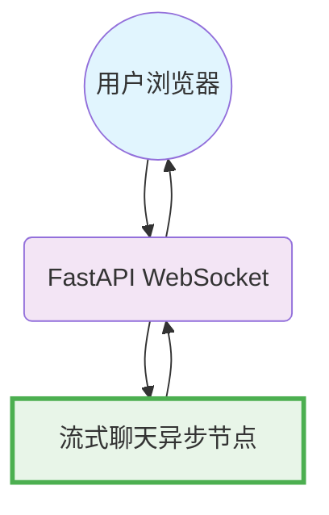

# 设计文档：FastAPI WebSocket 聊天界面

> 请勿删除 AI 备注

## 要求

> AI 备注：保持简洁明了。
> 如果要求是抽象的，请编写具体的用例。

**用户故事**：作为用户，我希望通过一个网页界面与 AI 聊天机器人互动，其中：
1. 我可以发送消息并接收实时流式响应
2. 连接保持持久（WebSocket）
3. 我可以看到 AI 响应在 LLM 生成时实时打出
4. 界面简洁易用

**技术要求**：
- 支持 WebSocket 的 FastAPI 后端
- 实时双向通信
- 使用 PocketFlow AsyncNode 实现真正的 LLM 流式集成
- 简单的 HTML/JavaScript 前端
- 最少的依赖

## 流程设计

> AI 备注：
> 1. 彻底理解实用函数定义，请查阅文档。
> 2. 仅包含必要的实用函数，基于流程中的节点。

### 适用设计模式：

**单异步节点模式**：一个 PocketFlow AsyncNode 处理整个 LLM 流式传输过程，并进行实时 WebSocket 流式传输

### 流程高级设计：

**PocketFlow AsyncFlow**：只有一个异步节点
1. **流式聊天节点**：处理消息，调用 LLM 进行实时流式传输，立即将分块发送到 WebSocket

**集成**：FastAPI WebSocket 端点调用 PocketFlow AsyncFlow



## 实用函数

> AI 备注：
> 1. 彻底理解实用函数定义，请查阅文档。
> 2. 仅包含必要的实用函数，基于流程中的节点。

1. **流式 LLM** (`utils/stream_llm.py`)
   - *输入*：消息（聊天历史列表）
   - *输出*：生成器，从 OpenAI API 生成实时响应分块
   - 由流式聊天节点使用，以获取 LLM 生成的分块

## 节点设计

### 共享存储

> AI 备注：尽量减少数据冗余

共享存储结构如下：

```python
shared = {
    "websocket": None,           # WebSocket 连接对象
    "user_message": "",          # 当前用户消息
    "conversation_history": []   # 带有角色的消息历史列表
}
```

### 节点步骤

> AI 备注：仔细决定是使用批处理/异步节点/流程。

1. **流式聊天节点**
  - *目的*：处理用户消息，调用 LLM 进行实时流式传输，并通过 WebSocket 立即发送分块
  - *类型*：AsyncNode（用于实时流式传输）
  - *步骤*：
    - *prep*：读取用户消息，使用新消息构建对话历史
    - *exec_async*：调用流式 LLM 实用程序，接收到每个分块后立即流式传输到 WebSocket
    - *post*：使用完整的助手响应更新对话历史
