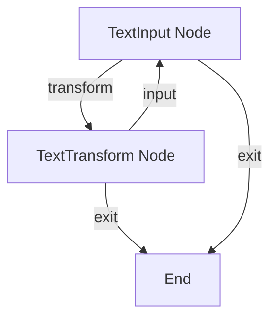

# 文本转换器流程

该项目展示了一个使用 PocketFlow 构建的交互式文本转换工具。

## 功能

- 将文本转换为大写
- 将文本转换为小写
- 反转文本
- 移除多余空格
- 交互式命令行界面
- 连续流程，可选择处理多个文本

## 入门

1. 安装所需依赖：

```bash
pip install -r requirements.txt
```

2. 运行应用程序：

```bash
python main.py
```

## 工作原理

工作流程具有一个带有分支路径的交互式循环：



每个部分的作用如下：
1. **TextInput Node**：收集文本输入并处理菜单选择
2. **TextTransform Node**：将选定的转换应用于文本

## 示例输出

```
Welcome to Text Converter!
=========================

Enter text to convert: Pocket Flow is a 100-line LLM framework

Choose transformation:
1. Convert to UPPERCASE
2. Convert to lowercase
3. Reverse text
4. Remove extra spaces
5. Exit

Your choice (1-5): 1

Result: POCKET FLOW IS A 100-LINE LLM FRAMEWORK

Convert another text? (y/n): n

Thank you for using Text Converter!
```

## 文件

- [`main.py`](./main.py)：运行文本转换器的主入口点
- [`flow.py`](./flow.py)：定义文本转换的节点和流程
- [`requirements.txt`](./requirements.txt)：列出所需依赖项
