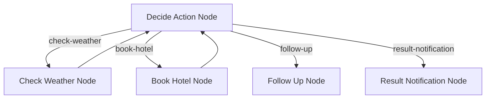

# PocketFlow Gradio 人机协作 (HITL) 示例

一个基于 Web 的应用程序，演示了如何使用 PocketFlow 和 Gradio 进行人机协作 (HITL) 工作流编排。此示例提供了一个交互式界面，供用户参与 AI 驱动的任务，同时保持人工监督和反馈。

## 功能

- **基于 Web 的界面**：使用 Gradio 构建，提供易于访问和用户友好的体验
- **人机协作集成**：将人工反馈无缝集成到 AI 工作流中
- **现代 UI**：简洁直观的界面，提供更好的用户交互
- **由 LLM 提供支持**：利用 OpenAI 模型进行智能任务处理
- **流程可视化**：实时可视化节点执行序列和工作流进度
- **交互式调试**：通过视觉反馈监控和理解决策过程

## 入门

该项目是 PocketFlow 烹饪书示例的一部分。假设您已经克隆了 [PocketFlow 仓库](https://github.com/ssvip9527/PocketFlow) 并且位于 `cookbook/pocketflow-gradio-hitl` 目录中。

1. **安装所需依赖**：
    ```bash
    pip install -r requirements.txt
    ```

2. **设置您的 OpenAI API 密钥**：
    应用程序使用 OpenAI 模型进行处理。您需要将您的 API 密钥设置为环境变量：
    ```bash
    export OPENAI_API_KEY="your-openai-api-key-here"
    ```

3. **运行应用程序**：
    ```bash
    python main.py
    ```
    这将启动 Gradio Web 界面，通常可在 `http://localhost:7860` 访问

## 工作原理

该系统实现了带有 Web 界面的 PocketFlow 工作流：



工作流包含以下节点：

1. **决策节点 (Decide Action Node)**：根据用户输入和上下文决定下一步操作的中心决策节点
2. **检查天气节点 (Check Weather Node)**：提供指定城市和日期的天气信息
3. **预订酒店节点 (Book Hotel Node)**：处理酒店预订请求，包括入住和退房日期
4. **跟进节点 (Follow Up Node)**：通过提出澄清问题或处理超出范围的请求来管理人机交互
5. **结果通知节点 (Result Notification Node)**：传递操作结果并提供额外帮助

流程通过一系列有向连接进行编排：
- 决策节点可以触发天气检查、酒店预订、跟进或结果通知
- 天气检查和酒店预订可以反馈到决策节点以进行进一步处理
- 跟进和结果通知节点提供工作流中的最后步骤

### 流程可视化

应用程序提供工作流执行的实时可视化：
- 节点激活序列按时间顺序显示
- 用户可以看到正在采取的决策路径
- 可视化有助于理解 AI 的决策过程


## 示例输出

以下是预订酒店的示例：


以下是对话中途改变意图的示例：


## 文件

- [`main.py`](./main.py)：应用程序和 Gradio 界面设置的入口点
- [`flow.py`](./flow.py)：定义 PocketFlow 图和节点连接
- [`nodes.py`](./nodes.py)：包含工作流的节点定义
- [`utils/`](./utils/)：包含实用函数和辅助模块
- [`requirements.txt`](./requirements.txt)：列出项目依赖项

## 要求

- Python 3.8+
- PocketFlow >= 0.0.2
- Gradio >= 5.29.1
- OpenAI >= 1.78.1
