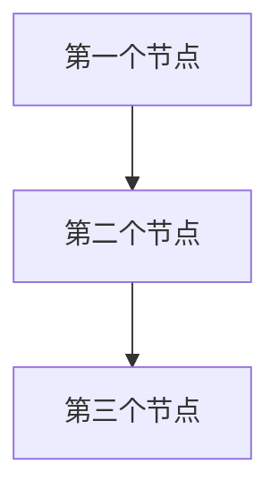

# 您的项目标题

## 项目需求
项目需求的描述。

## 实用函数

1. **调用 LLM** (`utils/call_llm.py`)

## 流程设计

1. **第一个节点**
2. **第二个节点**
3. **第三个节点**

### 流程图



## 数据结构

共享内存结构将组织如下：

```python
shared = {
    "key": "value"
}
```

## 节点设计

### 1. 第一个节点
- **目的**：节点的作用
- **设计**：常规节点（无批处理/异步）
- **数据访问**：
  - 读取：共享存储中的 "key"
  - 写入："key" 到共享存储

### 2. 第二个节点
...

### 3. 第三个节点
