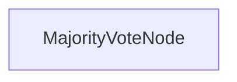

# 多数投票推理

本项目展示了一个多数投票实现，它通过聚合多次独立的尝试，使大型语言模型（LLM）能够解决复杂的推理问题。它旨在通过基于共识的推理来提高问题解决的准确性。

## 特性

- 通过多次尝试提高模型在复杂问题上的可靠性
- 适用于 Claude 3.7 Sonnet 等模型
- 解决单次尝试通常无法解决的问题
- 提供详细的推理跟踪以供验证
- 使用共识方法减少偶尔推理错误的影响

## 入门

1. 安装所需的包：
```bash
pip install -r requirements.txt
```

2. 设置您的 API 密钥：
```bash
export ANTHROPIC_API_KEY="your-api-key-here"
```

3. 运行一个测试问题，查看多数投票的实际效果：
```bash
python main.py
```

4. 尝试您自己的推理问题：
```bash
python main.py --problem "您的复杂推理问题" --tries 5
```

## 工作原理

该实现使用 `MajorityVoteNode` 来处理多次尝试并达成共识：



`MajorityVoteNode`：
1. 对同一问题进行多次独立尝试
2. 从每次尝试中收集结构化答案
3. 确定最频繁的答案作为最终解决方案
4. 返回共识答案

这种方法有助于克服单个尝试中可能出现的偶尔推理错误。

## 示例问题

来自 [Quant Interview](https://www.youtube.com/watch?v=SCP7JptxPU0) 的示例问题：

```
你在一间鞋厂工作。你面前有三双鞋（六只独立的鞋），尺码如下：两只 4 码，两只 5 码，两只 6 码。工厂将“可接受的配对”定义为尺码差异最多为一码的两只鞋（例如，5 码和 6 码将是可接受的配对）。如果你闭上眼睛，随机抽取三双鞋，不放回，那么你最终抽到三双可接受的配对的概率是多少？
```

下面是多数投票方法如何使用 Claude 3.7 Sonnet 解决这个复杂问题的示例：

```
========================
所有结构化答案: ['0.333', '0.333', '0.333', '0.6', '0.333']
多数投票 => 0.333
频率 => 4
========================

=== 最终答案 ===
0.333
====================
```

这表明 5 次尝试中有 4 次得出了相同的答案（0.333），该答案被选为最终解决方案。

## 文件

- [`main.py`](./main.py)：多数投票节点和流程的实现
- [`utils.py`](./utils.py)：调用 Anthropic 模型的简单封装