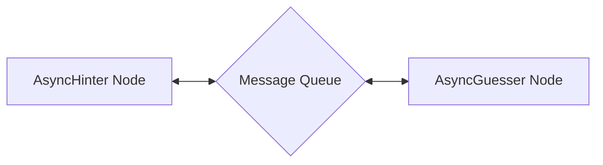

# 多智能体禁忌游戏

这是一个 PocketFlow 示例，演示了如何使用禁忌猜词游戏实现异步多智能体通信。

## 特性

- 实现两个 AI 智能体（提示者和猜词者）之间的异步通信
- 使用 AsyncNode 进行非阻塞智能体交互
- 通过 asyncio 消息队列创建动态对话流
- 使用 LLM 演示复杂的基于回合的游戏机制
- 在猜对正确单词时自动终止游戏

## 入门指南

1. 安装所需的依赖项：

```bash
pip install -r requirements.txt
```

2. 将您的 OpenAI API 密钥设置为环境变量：

```bash
export OPENAI_API_KEY=your_api_key_here
```

3. 运行应用程序：

```bash
python main.py
```

## 工作原理

工作流程遵循异步多智能体通信模式：



每个组件的功能如下：

1. **AsyncHinter 节点**：生成关于目标词的提示，同时避免禁用词
2. **AsyncGuesser 节点**：根据从提示者接收到的提示进行猜测
3. **消息队列**：促进智能体之间的异步通信

## 文件

- [`main.py`](./main.py)：实现 AsyncHinter 和 AsyncGuesser 节点以及游戏流程的主入口点
- [`utils.py`](./utils.py)：实用函数，包括用于生成提示和猜测的 LLM 包装器
- [`requirements.txt`](./requirements.txt)：列出所需的依赖项

## 示例输出

```
=========== Taboo Game Starting! ===========
Target word: nostalgic
Forbidden words: ['memory', 'past', 'remember', 'feeling', 'longing']
============================================

Hinter: Here's your hint - Sentiment for earlier times.
Guesser: I guess it's - Nostalgia

Hinter: Here's your hint - Sentiment for earlier times.
Guesser: I guess it's - Reminiscence

Hinter: Here's your hint - Yearning for days gone by.
Guesser: I guess it's - Sentimentality

Hinter: Here's your hint - Reliving cherished moments or experiences.
Guesser: I guess it's - Memories

Hinter: Here's your hint - Recollection of cherished experiences.
Guesser: I guess it's - Reflection

Hinter: Here's your hint - Yearning for earlier times.
Guesser: I guess it's - Longing

Hinter: Here's your hint - Sentiment for earlier times.
Guesser: I guess it's - Nostalgic
Game Over - Correct guess!
```