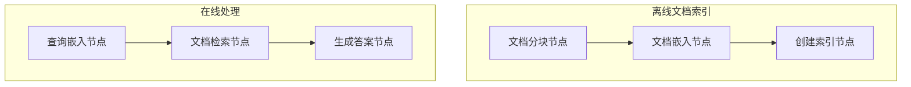

# 检索增强生成 (RAG)

该项目演示了一个简化的 RAG 系统，它根据用户查询检索相关文档并使用 LLM 生成答案。此实现直接基于教程：[从零开始的检索增强生成 (RAG) — 傻瓜教程](https://zacharyhuang.substack.com/p/retrieval-augmented-generation-rag)。


## 功能

-   文档分块以处理长文本
-   FAISS 支持的基于向量的文档检索
-   LLM 支持的答案生成

## 如何运行

1.  设置您的 API 密钥:
    ```bash
    export OPENAI_API_KEY="your-api-key-here"
    ```
    或者直接在 `utils.py` 中更新它

    让我们快速检查一下您的 API 密钥是否正常工作:

    ```bash
    python utils.py
    ```

2.  安装并使用默认查询运行:
    ```bash
    pip install -r requirements.txt
    python main.py
    ```

3.  使用示例查询运行应用程序:

    ```bash
    python main.py --"Q-Mesh 协议如何实现高事务速度？"
    ```

## 工作原理

这一切都通过 PocketFlow 实现的两阶段管道来完成:



每个部分的作用如下:
1.  **ChunkDocumentsNode**: 将文档分解成更小的块以便更好地检索
2.  **EmbedDocumentsNode**: 将文档块转换为向量表示
3.  **CreateIndexNode**: 从嵌入中创建可搜索的 FAISS 索引
4.  **EmbedQueryNode**: 将用户查询转换为相同的向量空间
5.  **RetrieveDocumentNode**: 使用向量搜索查找最相似的文档
6.  **GenerateAnswerNode**: 使用 LLM 根据检索到的内容生成答案

## 示例输出

```
✅ 从 5 个文档创建了 5 个块
✅ 创建了 5 个文档嵌入
🔍 正在创建搜索索引...
✅ 索引已创建，包含 5 个向量
🔍 正在嵌入查询: 如何安装 PocketFlow？
🔎 正在搜索相关文档...
📄 已检索文档 (索引: 0, 距离: 0.3427)
📄 最相关文本: "Pocket Flow 是一个 100 行的极简 LLM 框架
        轻量级: 仅 100 行。零膨胀，零依赖，零供应商锁定。
        富有表现力: 您喜欢的一切——（多）代理，工作流，RAG 等。
        代理编码: 让 AI 代理（例如，Cursor AI）构建代理——10 倍生产力提升！
        要安装，请 pip install pocketflow 或直接复制源代码（仅 100 行）。"

🤖 生成的答案:
要安装 PocketFlow，请使用命令 `pip install pocketflow` 或直接复制其 100 行源代码。
```
