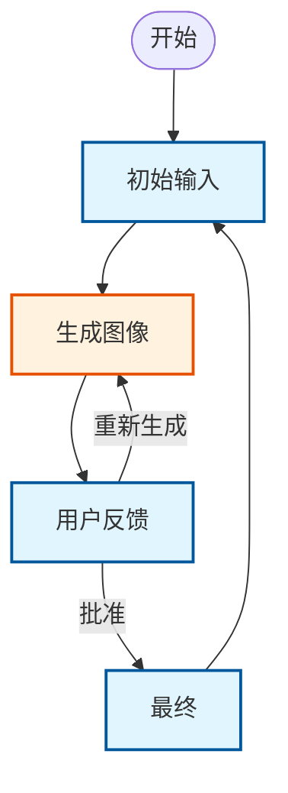

# 设计文档: PocketFlow Streamlit 图像生成 HITL

> 使用 PocketFlow 和 Streamlit 的人机协作图像生成应用

## 需求

**用户故事**：作为用户，我希望：
1. 输入一个描述我想要生成的图像的文本提示
2. 系统根据我的提示使用 OpenAI 的图像生成 API 生成图像
3. 在网页界面中审查生成的图像
4. 如果满意则批准图像，或者如果想要不同的结果则使用相同的提示重新生成
5. 将最终批准的图像作为完成的结果

**技术要求**：
- 使用 OpenAI 的图像生成 API（通过 `responses.create` 与 `image_generation` 工具）
- 将生成的图像保存在内存中（base64 格式）- 不进行磁盘存储
- 提供清晰的批准/重新生成工作流程
- 优雅地处理 API 错误并进行重试
- 在生成之间维护会话状态

## 流程设计

### 适用设计模式：

**带有多子流的状态机**：每个状态都有自己的用户界面和工作流程。用户在每个状态中与不同的 UI 元素交互，应用程序根据用户操作和反馈转换到下一个状态。

### 状态与用户界面：

1. **initial_input** - 用户看到文本输入字段，输入提示，点击“生成图像”按钮
2. **user_feedback** - 用户看到生成的图像，有“批准”和“重新生成”按钮
3. **final** - 用户看到最终批准的图像和“重新开始”按钮

### 流程高级设计与转换：



**图例**：
- 🔷 **蓝色矩形**：用户界面状态（初始输入、用户反馈、最终）
- 🔶 **橙色矩形**：PocketFlow 处理节点（生成图像）

## 实用功能

1. **生成图像** (`utils/generate_image.py`)
   - *输入*：提示 (str)
   - *输出*：base64 图像数据 (str)
   - *目的*：调用 OpenAI 的图像生成 API 并返回 base64 编码的图像
   - *错误处理*：包含 API 失败的重试逻辑

## 节点设计

### 共享内存

**使用 Streamlit 会话状态作为共享存储**：我们直接使用 `st.session_state` 作为 PocketFlow 的共享存储，无需单独的数据结构。

图像生成工作流程的会话状态结构：

```python
st.session_state = {
    # 用户输入和工作流状态
    "task_input": "用户用于图像生成的文本提示",
    "stage": "当前工作流阶段 (initial_input/user_feedback/final)",
    "error_message": "用于用户反馈的任何错误消息",
    
    # 处理数据
    "input_used_by_process": "用于生成的提示",
    "generated_image": "base64 编码的图像数据",
    "final_result": "最终批准的图像数据",
    
    # Streamlit 内置键（自动管理）
    # "_streamlit_*": 各种内部 streamlit 状态
}
```

### 节点步骤

**初始输入流程节点**：

1. **图像生成节点**
   - *目的*：根据提示使用 OpenAI API 生成图像
   - *类型*：常规（带重试以提高 API 可靠性）
   - *步骤*：
     - *prep*：从 `st.session_state` 读取 "input_used_by_process"
     - *exec*：使用提示调用 `generate_image` 实用程序，返回 base64 图像数据
     - *post*：将 base64 图像数据写入 `st.session_state` 中的 "generated_image"

**用户反馈流程**：
- 当用户点击“重新生成”时，重用相同的 `GenerateImage` 节点

**最终流程**：
- 不需要处理节点 - `final` 状态只显示 `generated_image` 中批准的图像，并提供重新开始的 UI
