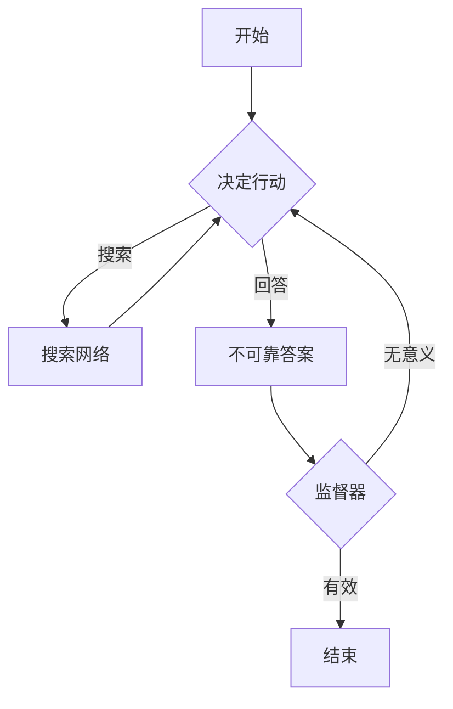

# PocketFlow 监督器示例

这个示例展示了如何使用 PocketFlow 构建一个具有监督功能的代理。它演示了如何创建一个代理，该代理可以搜索网络以回答问题，并且有一个“监督器”节点来评估答案的质量。如果答案被认为是无意义的，流程将重新启动以尝试生成更好的答案。

## 功能

- **网络搜索集成**：代理可以利用网络搜索工具获取最新信息。
- **LLM 驱动的决策**：使用大型语言模型 (LLM) 决定何时搜索以及何时回答。
- **答案监督**：一个专门的节点评估生成的答案，并在必要时触发重试。
- **健壮性**：通过重试机制处理不可靠的答案。

## 项目结构

```
. 
├── flow.py          # 定义 PocketFlow 流程
├── main.py          # 应用程序入口点
├── nodes.py         # 定义自定义节点（决策、搜索、不可靠答案、监督器）
├── README.md        # 本文件
├── requirements.txt # Python 依赖项
└── utils.py         # 辅助函数（LLM 调用，网络搜索）
```

## 设置

1.  **克隆仓库**：
    ```bash
    git clone https://github.com/your-repo/pocketflow-supervisor.git
    cd pocketflow-supervisor
    ```

2.  **安装依赖项**：
    ```bash
    pip install -r requirements.txt
    ```

3.  **配置 OpenAI API 密钥**：
    确保你的 OpenAI API 密钥已设置为环境变量 `OPENAI_API_KEY`。
    ```bash
    export OPENAI_API_KEY="你的密钥"
    ```

## 如何运行

运行 `main.py` 脚本并提供一个问题作为命令行参数：

```bash
python main.py "什么是大型语言模型？"
```

## 工作原理

该代理遵循一个循环过程，直到生成一个被监督器批准的答案。以下是流程图和每个组件的说明：

### 流程图



### 组件说明

-   **`DecideAction` 节点**：
    -   **目的**：根据当前问题和研究决定下一步是“搜索”网络还是“回答”问题。
    -   **机制**：调用 LLM 来做出此决策，并提供上下文和可用行动空间。

-   **`SearchWeb` 节点**：
    -   **目的**：执行网络搜索以获取更多信息。
    -   **机制**：使用 `utils.py` 中的 `search_web` 函数，并将结果添加到共享上下文。
    -   **后续**：搜索后始终返回 `DecideAction` 节点以重新评估。

-   **`UnreliableAnswerNode` 节点**：
    -   **目的**：生成问题的答案，但有 50% 的几率故意返回一个无意义的答案，以模拟不可靠的系统。
    -   **机制**：调用 LLM 生成答案，或者随机返回一个预设的无意义字符串。

-   **`SupervisorNode` 节点**：
    -   **目的**：评估 `UnreliableAnswerNode` 生成的答案的质量。
    -   **机制**：检查答案中是否存在特定的“无意义”标记（例如，“咖啡休息”、“紫色独角兽”）。
    -   **后续**：如果答案被认为是无意义的，它会清除答案并触发流程重新回到 `DecideAction` 节点（通过返回“retry”），从而有效地重新启动答案生成过程。如果答案有效，流程结束。

## 示例输出

当运行代理时，你将看到类似于以下内容的输出（确切的输出会因 LLM 响应和随机性而异）：

```
🤔 代理正在决定下一步...
🔍 代理决定搜索: 大型语言模型
🌐 正在搜索网络: 大型语言模型
📚 找到信息，正在分析结果...
🤔 代理正在决定下一步...
✍️ 正在撰写最终答案...
    🔍 监督器正在检查答案质量...
    ✅ 监督器批准答案: 答案似乎是合法的
✅ 答案生成成功
最终答案: 大型语言模型（LLM）是具有大量参数的深度学习模型，它们在海量文本数据集上进行训练，能够理解、生成和处理人类语言。
```

或者，如果 `UnreliableAnswerNode` 返回一个无意义的答案：

```
🤔 代理正在决定下一步...
✍️ 正在撰写最终答案...
🤪 正在生成不可靠的虚拟答案...
    🔍 监督器正在检查答案质量...
    ❌ 监督器拒绝答案: 答案似乎是无意义或无用的
🤔 代理正在决定下一步...
🔍 代理决定搜索: 大型语言模型
🌐 正在搜索网络: 大型语言模型
📚 找到信息，正在分析结果...
🤔 代理正在决定下一步...
✍️ 正在撰写最终答案...
    🔍 监督器正在检查答案质量...
    ✅ 监督器批准答案: 答案似乎是合法的
✅ 答案生成成功
最终答案: 大型语言模型（LLM）是具有大量参数的深度学习模型，它们在海量文本数据集上进行训练，能够理解、生成和处理人类语言。
```

这个示例展示了 PocketFlow 如何实现复杂的、有条件的流程，以及如何通过集成外部工具和监督机制来增强代理的健壮性。
