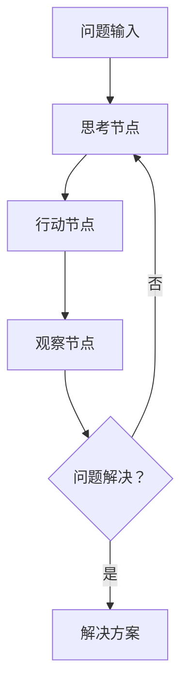

# PocketFlow TAO（思维-行动-观察）

一个强大的模式，使AI代理能够通过结构化的思考、行动执行和结果观察来解决复杂问题。此示例演示了如何使用PocketFlow实现TAO模式。

## 项目结构

```
.
├── flow.py        # PocketFlow中TAO模式的实现
├── main.py        # 主应用程序入口
├── nodes.py       # TAO节点定义
├── requirements.txt # 项目依赖
└── README.md      # 项目文档
```

## 概述

TAO模式包含三个关键步骤：
1. **思考**：代理深入分析问题并形成解决策略
2. **行动**：基于思考执行具体行动
3. **观察**：评估结果并收集反馈

该循环持续进行，直到问题解决或满足终止条件。

## 设置

1. 创建虚拟环境：
```bash
python -m venv venv
source venv/bin/activate  # Windows上：venv\Scripts\activate
```

2. 安装依赖：
```bash
pip install -r requirements.txt
```

3. 设置API密钥（如果使用特定的LLM服务）：
```bash
export OPENAI_API_KEY="your-api-key-here"
# 或在代码中设置
```

## 如何运行

执行示例：
```bash
python main.py
```

## 工作原理

TAO模式作为PocketFlow中的一个流程实现，每个步骤由专门的节点处理：



每个TAO循环为问题解决过程生成新的见解，使AI能够迭代地接近最优解。

## 使用场景

- 复杂问题解决
- 多步骤推理任务
- 需要迭代改进的项目
- 类强化学习的AI应用

## 示例输出

```
查询：我需要了解人工智能的最新发展

🤔 思考 1：决定执行搜索
🚀 执行动作：搜索，输入：2023年人工智能最新发展
✅ 行动完成，结果已获得
👁️ 观察：搜索结果显示信息...
🎯 最终答案：截至2023年10月，人工智能的一些最新发展包括大型语言模型如GPT-4的进步，更多关注AI对齐和安全性，强化学习的改进，以及AI在医疗、金融和自动驾驶等更多行业的整合。研究人员还在探索伦理考虑和监管框架，以确保负责任的AI部署。对于此日期之后的最新更新，建议查看最新出版物、官方AI研究机构发布或专注于技术的新闻来源。

流程结束，感谢使用！

最终答案：
截至2023年10月，人工智能的一些最新发展包括大型语言模型如GPT-4的进步，更多关注AI对齐和安全性，强化学习的改进，以及AI在医疗、金融和自动驾驶等更多行业的整合。研究人员还在探索伦理考虑和监管框架，以确保负责任的AI部署。对于此日期之后的最新更新，建议查看最新出版物、官方AI研究机构发布或专注于技术的新闻来源。
```

## 高级用法

TAO模式可以扩展为：
- 添加记忆组件以存储过去的思考和观察
- 实现自适应行动选择策略
- 集成外部工具和API
- 添加人工反馈环
- 添加最大尝试次数以控制迭代

## 额外资源

- [PocketFlow文档](https://the-pocket.github.io/PocketFlow/)
- [通过思维-行动-观察循环理解AI代理](https://huggingface.co/learn/agents-course/en/unit1/agent-steps-and-structure)