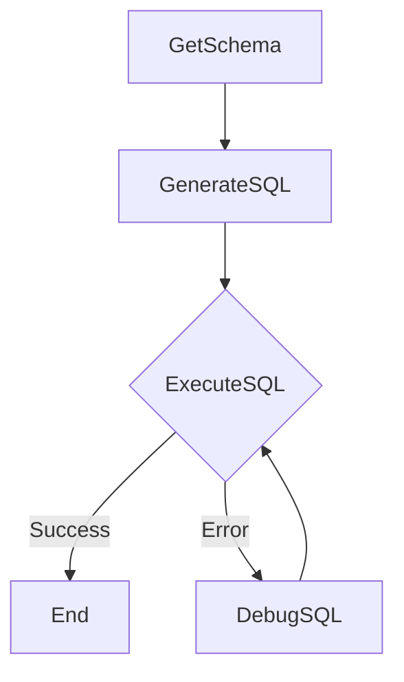

# 设计文档：文本到SQL代理

> 请不要删除AI的备注

## 需求

> AI备注：保持简单和清晰。
> 如果需求是抽象的，请编写具体的用户故事

系统应接受自然语言查询和SQLite数据库路径作为输入。然后它应该：
1. 从数据库中提取模式。
2. 根据自然语言查询和模式生成SQL查询。
3. 在数据库上执行SQL查询。
4. 如果SQL执行失败，尝试调试并重试SQL生成和执行，直到达到指定的最大尝试次数。
5. 返回SQL查询的最终结果或如果过程失败则返回错误信息。

## 流程设计

> AI备注：
> 1. 考虑代理、map-reduce、rag和工作流的设计模式。如果适合，请应用它们。
> 2. 提供简洁的高层次工作流描述。

### 适用的设计模式：

主要设计模式是一个嵌入调试行为的**工作流**。
- **工作流**：过程遵循一个序列：获取模式 -> 生成SQL -> 执行SQL。
- **代理（用于调试）**：如果`ExecuteSQL`失败，`DebugSQL`节点像代理一样，使用错误和之前的SQL作为上下文生成修订后的SQL查询。这形成一个返回到`ExecuteSQL`的循环。

### 流程高层设计：

1. **`GetSchema`**：检索数据库模式。
2. **`GenerateSQL`**：从自然语言问题和模式生成SQL查询。
3. **`ExecuteSQL`**：执行生成的SQL。如果成功，流程结束。如果发生错误，则转到`DebugSQL`。
4. **`DebugSQL`**：尝试根据错误信息纠正失败的SQL查询。然后返回到`ExecuteSQL`尝试修正后的查询。



## 实用功能

> AI备注：
> 1. 通过查看文档彻底理解实用功能定义。
> 2. 仅根据流程中的节点包含必要的实用功能。

1. **调用LLM** (`utils/call_llm.py`)
    * *输入*：`prompt` (str)
    * *输出*：`response` (str)
    * *必要性*：由`GenerateSQL`和`DebugSQL`节点使用，与语言模型进行交互以进行SQL生成和纠正。

*数据库交互（例如，`sqlite3.connect`，`cursor.execute`）直接在节点内处理，并未在此实现中抽象为单独的实用功能。*

## 节点设计

### 共享存储

> AI备注：尽量减少数据冗余

共享存储结构组织如下：

```python
shared = {
    "db_path": "path/to/database.db",       # 输入：SQLite数据库路径
    "natural_query": "用户的问题",      # 输入：用户的自然语言查询
    "max_debug_attempts": 3,                # 输入：调试循环的最大重试次数
    "schema": None,                         # GetSchema的输出：数据库模式的字符串表示
    "generated_sql": None,                  # GenerateSQL/DebugSQL的输出：SQL查询字符串
    "execution_error": None,                # ExecuteSQL的输出（失败时）：错误信息
    "debug_attempts": 0,                    # 内部：调试尝试计数器
    "final_result": None,                   # ExecuteSQL的输出（成功时）：查询结果
    "result_columns": None,                 # ExecuteSQL的输出（成功时）：结果的列名
    "final_error": None                     # 输出：流程在重试后失败时的总体错误信息
}
```

### 节点步骤

> AI备注：仔细决定是否使用批处理/异步节点/流程。

1. **`GetSchema`**
    * *目的*：提取并存储目标SQLite数据库的模式。
    * *类型*：常规
    * *步骤*：
        * *`prep`*：从共享存储中读取`db_path`。
        * *`exec`*：连接到SQLite数据库，检查`sqlite_master`和`PRAGMA table_info`以构建所有表及其列的字符串表示。
        * *`post`*：将提取的`schema`字符串写入共享存储。

2. **`GenerateSQL`**
    * *目的*：根据用户的自然语言查询和数据库模式生成SQL查询。
    * *类型*：常规
    * *步骤*：
        * *`prep`*：从共享存储中读取`natural_query`和`schema`。
        * *`exec`*：构建LLM的提示，包括模式和自然语言查询，要求以YAML格式的SQL查询。调用`call_llm`实用功能。解析YAML响应以提取SQL查询。
        * *`post`*：将`generated_sql`写入共享存储。将`debug_attempts`重置为0。

3. **`ExecuteSQL`**
    * *目的*：在数据库上执行生成的SQL查询并处理结果或错误。
    * *类型*：常规
    * *步骤*：
        * *`prep`*：从共享存储中读取`db_path`和`generated_sql`。
        * *`exec`*：连接到SQLite数据库并执行`generated_sql`。确定查询是SELECT还是DML/DDL语句以获取结果或提交更改。返回一个元组`(success_boolean, result_or_error_message, column_names_list)`。
        * *`post`*：
            * 如果成功：将`final_result`和`result_columns`存储在共享存储中。返回无操作（结束流程路径）。
            * 如果失败：将`execution_error`存储在共享存储中。增加`debug_attempts`。如果`debug_attempts`小于`max_debug_attempts`，返回`"error_retry"`操作以触发`DebugSQL`节点。否则，设置`final_error`并返回无操作。

4. **`DebugSQL`**
    * *目的*：尝试使用LLM根据错误信息纠正失败的SQL查询。
    * *类型*：常规
    * *步骤*：
        * *`prep`*：从共享存储中读取`natural_query`、`schema`、`generated_sql`（失败的）和`execution_error`。
        * *`exec`*：构建LLM的提示，提供失败的SQL、原始查询、模式和错误信息，要求以YAML格式的修正SQL查询。调用`call_llm`实用功能。解析YAML响应以提取修正后的SQL查询。
        * *`post`*：用修正后的SQL覆盖共享存储中的`generated_sql`。从共享存储中移除`execution_error`。返回默认操作以返回到`ExecuteSQL`。
