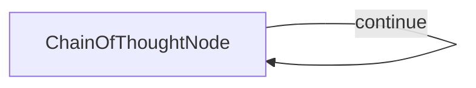

# Chain of Thought Node Design

## 1. 需求
创建一个能够自循环的思维链节点，它可以：
- 通过维护和执行结构化计划逐步解决问题
- 在继续之前批判性地评估前一步骤的推理和结果
- 通过将复杂步骤分解为嵌套子步骤来完善计划
- 更新计划步骤的状态(`Pending`, `Done`, `Verification Needed`)并记录简洁结果
- 通过调整计划来处理评估过程中发现的潜在错误
- 提供思维过程和计划演变的详细跟踪
- 在计划完成时生成总结解决方案的最终结论

## 2. 流程设计
这将是一个简单的流程，包含一个可以根据计划是否需要更多思考而反复调用自身的单一节点：



## 3. 实用工具
我们需要一个主要的实用函数：
- `call_llm`: 调用LLM基于问题、先前思考和当前计划状态生成下一个思考(包括评估、思考和更新计划)。辅助函数(`format_plan`, `format_plan_for_prompt`)帮助呈现计划。

## 4. 节点设计
### 共享存储设计
```python
shared = {
    "problem": str,             # The problem statement.
    "thoughts": list[dict],     # List of thought dictionaries generated so far.
    "current_thought_number": int, # Counter for the current thought being generated.
    "solution": str | None    # Stores the final conclusion text when finished.
}
```

添加到`shared["thoughts"]`列表中的每个思考字典将包含LLM执行步骤的结构化输出，以及思考编号：
```python
{
    "thought_number": int,      # The sequence number of this thought.
    "current_thinking": str,    # Detailed text of the evaluation and thinking for this step.
    "planning": list[dict],     # The updated plan structure (list of dictionaries).
    "next_thought_needed": bool # Flag indicating if the loop should continue.
}
```

`planning`列表包含表示步骤的字典，这些步骤可以嵌套：
```python
# Example structure for a plan step dictionary
{
    "description": str,                     # Description of the step.
    "status": str,                          # "Pending", "Done", "Verification Needed".
    "result": str | None,                   # Optional: Concise result when status is "Done".
    "mark": str | None,                     # Optional: Reason for "Verification Needed".
    "sub_steps": list[dict] | None          # Optional: Nested list for sub-steps.
}
```

### 思维链节点(`ChainOfThoughtNode`)
-   **`type`**: 常规(自循环节点)
-   **`prep`**:
    -   从共享存储中读取问题陈述和先前的思考列表
    -   将思考历史和*最后已知的计划结构*格式化为适合LLM提示的文本表示
    -   确定是否是第一次思考以调整提示指令
    -   递增并更新`shared["current_thought_number"]`
-   **`exec`**:
    -   为LLM构建详细提示，包括：
        -   问题陈述
        -   先前思考和计划的格式化历史
        -   用于评估先前思考、执行下一个待处理步骤、更新计划结构(使用字典格式)、处理子步骤、管理状态/结果和指示完成的特定指令
        -   所需的YAML输出格式(`current_thinking`, `planning`, `next_thought_needed`)
    -   使用提示调用`call_llm`实用程序
    -   解析LLM的YAML响应
    -   使用`assert`验证所需键(`current_thinking`, `planning`, `next_thought_needed`)的存在和基本类型
    -   将`thought_number`添加到解析数据中
-   **`post`**:
    -   将来自`exec`的结果字典附加到`shared["thoughts"]`列表
    -   检查执行结果中的`next_thought_needed`标志
    -   如果`False`:
        -   提取`current_thinking`内容作为最终的`shared["solution"]`
        -   打印最终思考、计划和解决方案
        -   返回`"end"`以终止流程循环
    -   如果`True`:
        -   打印当前思考编号、思考内容和格式化的当前计划状态
        -   返回`"continue"`以触发节点的下一次迭代