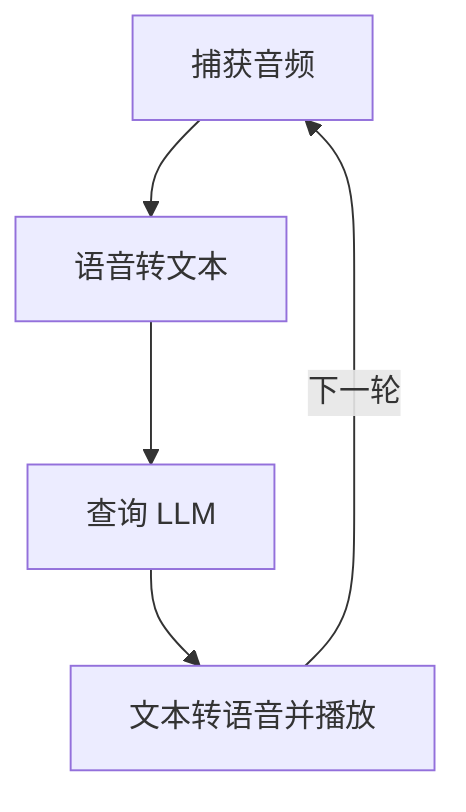

# PocketFlow Voice Chat

该项目演示了一个使用 PocketFlow 构建的基于语音的交互式聊天应用程序。用户可以语音提问，系统将通过 LLM 的语音回答进行响应，并维护对话历史记录。

- 查看 [Substack 教程文章](https://pocketflow.substack.com/p/build-your-own-voice-chatbot-from) 了解更多信息！


## 功能

-   **语音活动检测 (VAD)**：自动检测用户何时开始和停止说话。
-   **语音转文本 (STT)**：使用 OpenAI 将语音转换为文本。
-   **LLM 交互**：使用 LLM（例如 GPT-4o）处理转录文本，并维护对话历史记录。
-   **文本转语音 (TTS)**：使用 OpenAI 将 LLM 的文本响应转换回可听语音。
-   **持续对话**：响应后循环返回以监听下一个用户查询，从而实现持续对话。

## 如何运行

1.  **设置您的 OpenAI API 密钥**：
    ```bash
    export OPENAI_API_KEY="your-api-key-here"
    ```
    确保已设置此环境变量，因为 STT、LLM 和 TTS 的实用脚本都依赖于它。
    您可以测试单个实用函数（例如 `python utils/call_llm.py`、`python utils/text_to_speech.py`）以帮助验证您的 API 密钥和设置。

2.  **安装依赖项**：
    确保您已安装 Python。然后，使用 pip 安装所需的库：
    ```bash
    pip install -r requirements.txt
    ```
    这将安装 `openai`、`pocketflow`、`sounddevice`、`numpy`、`scipy` 和 `soundfile` 等库。

    **Linux 用户注意事项**：`sounddevice` 可能需要 PortAudio。如果遇到问题，您可能需要先安装它：
    ```bash
    sudo apt-get update && sudo apt-get install -y portaudio19-dev
    ```

3.  **运行应用程序**：
    ```bash
    python main.py
    ```
    按照控制台提示操作。当您看到“正在聆听您的查询...”时，应用程序将开始监听。

## 工作原理

该应用程序使用 PocketFlow 工作流来管理对话步骤：



以下是流程中每个节点的作用：

1.  **`CaptureAudioNode`**：从用户麦克风录制音频。它使用语音活动检测 (VAD) 在检测到语音时开始录制，并在检测到静音时停止录制。
2.  **`SpeechToTextNode`**：获取录制的音频数据，将其转换为合适的格式，并将其发送到 OpenAI 的 STT API (gpt-4o-transcribe) 以获取转录文本。
3.  **`QueryLLMNode`**：获取用户的转录文本以及现有对话历史记录，并将其发送到 LLM（OpenAI 的 GPT-4o 模型）以生成智能响应。
4.  **`TextToSpeechNode`**：接收来自 LLM 的文本响应，使用 OpenAI 的 TTS API (gpt-4o-mini-tts) 将其转换为音频，并将音频播放给用户。如果对话设置为继续，它将转换回 `CaptureAudioNode`。

## 示例交互

当您运行 `main.py` 时：

1.  控制台将显示：
    ```
    正在启动 PocketFlow 语音聊天...
    在出现 '正在聆听您的查询...' 后说出您的查询。
    ...
    ```
2.  当您看到 `正在聆听您的查询...` 时，请对着麦克风清晰地说话。
3.  停止说话后，控制台将显示更新：
    ```
    音频已捕获 (X.XXs)，正在进行 STT。
    正在将语音转换为文本...
    用户: [您的转录查询将显示在此处]
    正在向 LLM 发送查询...
    LLM: [LLM 的响应文本将显示在此处]
    正在将 LLM 响应转换为语音...
    正在播放 LLM 响应...
    ```
4.  您将听到 LLM 的响应语音。
5.  应用程序将循环返回，您将再次看到 `正在聆听您的查询...`，准备好您的下一个输入。

对话将以这种方式继续。要停止应用程序，您通常需要中断它（例如，在终端中按 Ctrl+C），因为它被设计为连续循环。
