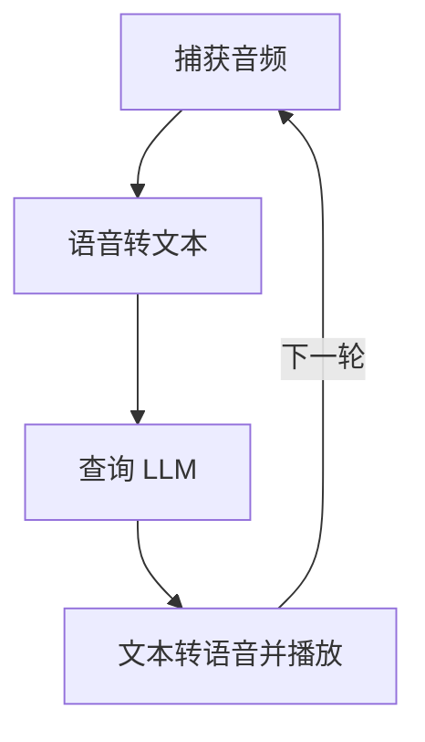
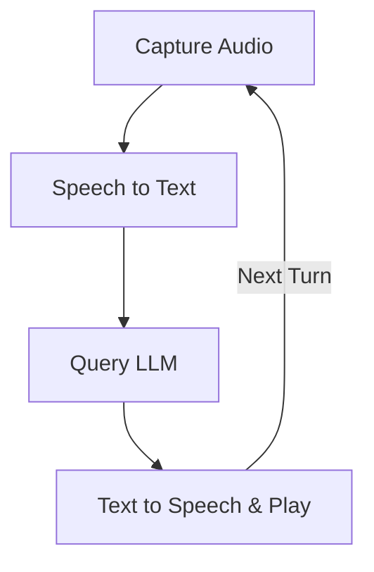

# 设计文档：PocketFlow 语音聊天

> 请勿删除 AI 备注

## 需求

> AI 备注：保持简洁明了。
> 如果需求抽象，请编写具体的用户故事

-   **目标**：使用户能够通过语音与 LLM 进行持续对话，并接收语音回复。
-   **用户故事 1**：作为用户，我希望对着麦克风说出我的查询，以便应用程序能够理解我在问什么。
-   **用户故事 2**：作为用户，我希望应用程序将我的语音查询发送给 LLM 进行处理。
-   **用户故事 3**：作为用户，我希望听到 LLM 的回复。
-   **用户故事 4**：作为用户，在听到回复后，我希望应用程序能够准备好我的下一个语音查询，而无需重新启动。
-   **核心功能**：
    1.  捕获音频输入。
    2.  将语音转换为文本 (STT)。
    3.  使用 LLM 处理文本（维护对话历史）。
    4.  将 LLM 文本回复转换为语音 (TTS)。
    5.  播放合成音频。
    6.  循环返回以捕获新的音频输入，实现持续对话。

## 流程设计

> AI 备注：
> 1. 考虑代理、Map-Reduce、RAG 和工作流的设计模式。如果适用，请应用它们。
> 2. 给出工作流的简洁、高级描述。

### 适用设计模式：

-   **工作流**：带有循环的顺序工作流最为合适。每个步骤（音频捕获、STT、LLM 查询、TTS、音频播放）直接跟随上一个步骤，播放完成后，流程返回到音频捕获阶段。

### 流程高级设计：

应用程序将以循环方式运行，以实现持续对话：
1.  **`CaptureAudioNode`**：在触发时从用户麦克风录制音频。
2.  **`SpeechToTextNode`**：将录制的音频转换为文本。
3.  **`QueryLLMNode`**：将转录的文本（带历史记录）发送到 LLM 并获取文本回复。
4.  **`TextToSpeechNode`**：将 LLM 的文本回复转换为内存中的音频数据，然后播放。完成后，流程返回到 `CaptureAudioNode`。



## 实用函数

> AI 备注：
> 1. 彻底理解实用函数定义，请查阅文档。
> 2. 仅包含必要的实用函数，基于流程中的节点。

1.  **`record_audio()`** (`utils/audio_utils.py`)
    -   *输入*：(可选) `sample_rate` (int, Hz, 例如 `DEFAULT_SAMPLE_RATE`)、`channels` (int, 例如 `DEFAULT_CHANNELS`)、`chunk_size_ms` (int, 例如 `DEFAULT_CHUNK_SIZE_MS`)、`silence_threshold_rms` (float, 例如 `DEFAULT_SILENCE_THRESHOLD_RMS`)、`min_silence_duration_ms` (int, 例如 `DEFAULT_MIN_SILENCE_DURATION_MS`)、`max_recording_duration_s` (int, 例如 `DEFAULT_MAX_RECORDING_DURATION_S`)、`pre_roll_chunks_count` (int, 例如 `DEFAULT_PRE_ROLL_CHUNKS`)。
    -   *输出*：一个元组 `(audio_data, sample_rate)`，其中 `audio_data` 是 float32 音频样本的 NumPy 数组，`sample_rate` 是录音采样率 (int)。如果未检测到语音或录音失败，则返回 `(None, sample_rate)`。
    -   *描述*：使用基于静音的语音活动检测 (VAD) 从麦克风录制音频。当检测到声音超过 `silence_threshold_rms` 时，缓冲 `pre_roll_chunks_count` 的音频并开始完整录制。在低于阈值的声音持续 `min_silence_duration_ms` 后或达到 `max_recording_duration_s` 时停止。
    -   *必要性*：由 `CaptureAudioNode` 用于获取用户语音输入。

2.  **`speech_to_text_api(audio_data, sample_rate)`** (`utils/speech_to_text.py`)
    -   *输入*：`audio_data` (bytes)、`sample_rate` (int，尽管 API 可能会从音频格式推断)。
    -   *输出*：`transcribed_text` (str)。
    -   *必要性*：由 `SpeechToTextNode` 用于将内存中的音频数据转换为文本。
    -   *示例模型*：OpenAI `gpt-4o-transcribe`。

3.  **`call_llm(messages)`** (`utils/call_llm.py`)
    -   *输入*：`messages` (字典列表，例如 `[{"role": "user", "content": "..."}, {"role": "assistant", "content": "..."}]`)。这应该是完整的对话历史，包括最新的用户查询。
    -   *输出*：`llm_response_text` (str)
    -   *必要性*：由 `QueryLLMNode` 用于获取智能回复。
    -   *示例模型*：OpenAI `gpt-4o`。

4.  **`text_to_speech_api(text_to_synthesize)`** (`utils/text_to_speech.py`)
    -   *输入*：`text_to_synthesize` (str)。
    -   *输出*：一个元组 `(audio_data, sample_rate)`，其中 `audio_data` 是内存中的音频字节（例如来自 OpenAI 的 MP3 格式），`sample_rate` 是音频采样率 (int，例如 OpenAI `gpt-4o-mini-tts` 的 24000 Hz)。
    -   *必要性*：由 `TextToSpeechNode` 用于将 LLM 文本转换为可语音的内存音频数据。
    -   *示例模型*：OpenAI `gpt-4o-mini-tts`。

5.  **`play_audio_data(audio_data, sample_rate)`** (`utils/audio_utils.py`)
    -   *输入*：`audio_data` (float32 音频样本的 NumPy 数组)、`sample_rate` (int)。
    -   *输出*：无。
    -   *必要性*：由 `TextToSpeechNode`（在其 `post` 方法中）用于播放内存中合成的语音。

## 节点设计

### 共享内存

> AI 备注：尽量减少数据冗余

共享内存结构如下：

```python
shared = {
    "user_audio_data": None,      # 来自用户的内存音频数据 (NumPy 数组)
    "user_audio_sample_rate": None, # int: 用户音频的采样率
    "chat_history": [],            # list: 对话历史 [{"role": "user/assistant", "content": "..."}]
    "continue_conversation": True # boolean: 控制主对话循环的标志
}
```

### 节点步骤

> AI 备注：仔细决定是否使用批处理/异步节点/流。

1.  **`CaptureAudioNode`**
    -   *目的*：使用 VAD 录制用户音频输入。
    -   *类型*：常规
    -   *步骤*：
        -   *prep*：检查 `shared["continue_conversation"]`。（如果动态，可能会从 `shared["config"]` 加载 VAD 参数）。
        -   *exec*：调用 `utils.audio_utils.record_audio()`（如果配置，则传递 VAD 参数）。这将返回一个 NumPy 数组和采样率。
        -   *post*：`audio_numpy_array, sample_rate = exec_res`。将 `audio_numpy_array` 写入 `shared["user_audio_data"]`，将 `sample_rate` 写入 `shared["user_audio_sample_rate"]`。返回 `"default"`。

2.  **`SpeechToTextNode`**
    -   *目的*：将录制的内存音频转换为文本。
    -   *类型*：常规
    -   *步骤*：
        -   *prep*：读取 `shared["user_audio_data"]` (NumPy 数组) 和 `shared["user_audio_sample_rate"]`。返回 `(user_audio_data_numpy, user_audio_sample_rate)`。
        -   *exec*：`audio_numpy_array, sample_rate = prep_res`。**将 `audio_numpy_array` 转换为音频 `bytes`（例如，使用 `scipy.io.wavfile.write` 到 `io.BytesIO` 对象以 WAV 格式）。** 调用 `utils.speech_to_text.speech_to_text_api(audio_bytes, sample_rate)`。
        -   *post*：
            -   令 `transcribed_text = exec_res`。
            -   将 `{"role": "user", "content": transcribed_text}` 追加到 `shared["chat_history"]`。
            -   清除 `shared["user_audio_data"]` 和 `shared["user_audio_sample_rate"]`，因为它们不再需要。
            -   返回 `"default"`（假设 STT 成功，根据简化）。

3.  **`QueryLLMNode`**
    -   *目的*：根据用户的查询和对话历史从 LLM 获取回复。
    -   *类型*：常规
    -   *步骤*：
        -   *prep*：读取 `shared["chat_history"]`。返回 `chat_history`。
        -   *exec*：`history = prep_res`。调用 `utils.call_llm.call_llm(messages=history)`。
        -   *post*：
            -   令 `llm_response = exec_res`。
            -   将 `{"role": "assistant", "content": llm_response}` 追加到 `shared["chat_history"]`。
            -   返回 `"default"`（假设 LLM 调用成功）。

4.  **`TextToSpeechNode`**
    -   *目的*：将 LLM 的文本回复转换为语音并播放。
    -   *类型*：常规
    -   *步骤*：
        -   *prep*：读取 `shared["chat_history"]`。识别最后一条消息，这应该是 LLM 的回复。返回其内容。
        -   *exec*：`text_to_synthesize = prep_res`。调用 `utils.text_to_speech.text_to_speech_api(text_to_synthesize)`。这将返回 `(llm_audio_bytes, llm_sample_rate)`。
        -   *post*：`llm_audio_bytes, llm_sample_rate = exec_res`。
            -   **将 `llm_audio_bytes`（例如，来自 TTS API 的 MP3 字节）转换为音频样本的 NumPy 数组（例如，使用 `pydub` 或 `soundfile` 等库进行解码）。**
            -   调用 `utils.audio_utils.play_audio_data(llm_audio_numpy_array, llm_sample_rate)`。
            -   (可选) 记录完成。
            -   如果 `shared["continue_conversation"]` 为 `True`，则返回 `"next_turn"` 以循环返回。
            -   否则，返回 `"end_conversation"`。


> Please DON'T remove notes for AI

## Requirements

> Notes for AI: Keep it simple and clear.
> If the requirements are abstract, write concrete user stories

-   **Goal**: Enable users to interact with an LLM via voice in a continuous conversation, receiving spoken responses.
-   **User Story 1**: As a user, I want to speak my query into a microphone so that the application can understand what I'm asking.
-   **User Story 2**: As a user, I want the application to send my spoken query to an LLM for processing.
-   **User Story 3**: As a user, I want to hear the LLM's response spoken back to me.
-   **User Story 4**: As a user, after hearing the response, I want the application to be ready for my next spoken query without restarting.
-   **Core Functionalities**:
    1.  Capture audio input.
    2.  Convert speech to text (STT).
    3.  Process text with an LLM (maintaining conversation history).
    4.  Convert LLM text response to speech (TTS).
    5.  Play back synthesized audio.
    6.  Loop back to capture new audio input for a continuous conversation.

## Flow Design

> Notes for AI:
> 1. Consider the design patterns of agent, map-reduce, rag, and workflow. Apply them if they fit.
> 2. Present a concise, high-level description of the workflow.

### Applicable Design Pattern:

-   **Workflow**: A sequential workflow with a loop is most appropriate. Each step (audio capture, STT, LLM query, TTS, audio playback) directly follows the previous, and after playback, the flow returns to the audio capture stage.

### Flow high-level Design:

The application will operate in a loop to allow for continuous conversation:
1.  **`CaptureAudioNode`**: Records audio from the user\'s microphone when triggered.
2.  **`SpeechToTextNode`**: Converts the recorded audio into text.
3.  **`QueryLLMNode`**: Sends the transcribed text (with history) to an LLM and gets a text response.
4.  **`TextToSpeechNode`**: Converts the LLM\'s text response into in-memory audio data and then plays it. After completion, the flow transitions back to the `CaptureAudioNode`.



## Utility Functions

> Notes for AI:
> 1. Understand the utility function definition thoroughly by reviewing the doc.
> 2. Include only the necessary utility functions, based on nodes in the flow.

1.  **`record_audio()`** (`utils/audio_utils.py`)
    -   *Input*: (Optional) `sample_rate` (int, Hz, e.g., `DEFAULT_SAMPLE_RATE`), `channels` (int, e.g., `DEFAULT_CHANNELS`), `chunk_size_ms` (int, e.g., `DEFAULT_CHUNK_SIZE_MS`), `silence_threshold_rms` (float, e.g., `DEFAULT_SILENCE_THRESHOLD_RMS`), `min_silence_duration_ms` (int, e.g., `DEFAULT_MIN_SILENCE_DURATION_MS`), `max_recording_duration_s` (int, e.g., `DEFAULT_MAX_RECORDING_DURATION_S`), `pre_roll_chunks_count` (int, e.g., `DEFAULT_PRE_ROLL_CHUNKS`).
    -   *Output*: A tuple `(audio_data, sample_rate)` where `audio_data` is a NumPy array of float32 audio samples, and `sample_rate` is the recording sample rate (int). Returns `(None, sample_rate)` if no speech is detected or recording fails.
    -   *Description*: Records audio from the microphone using silence-based Voice Activity Detection (VAD). Buffers `pre_roll_chunks_count` of audio and starts full recording when sound is detected above `silence_threshold_rms`. Stops after `min_silence_duration_ms` of sound below the threshold or if `max_recording_duration_s` is reached.
    -   *Necessity*: Used by `CaptureAudioNode` to get user\'s voice input.

2.  **`speech_to_text_api(audio_data, sample_rate)`** (`utils/speech_to_text.py`)
    -   *Input*: `audio_data` (bytes), `sample_rate` (int, though the API might infer this from the audio format).
    -   *Output*: `transcribed_text` (str).
    -   *Necessity*: Used by `SpeechToTextNode` to convert in-memory audio data to text.
    -   *Example Model*: OpenAI `gpt-4o-transcribe`.

3.  **`call_llm(messages)`** (`utils/call_llm.py`)
    -   *Input*: `messages` (list of dicts, e.g., `[{"role": "user", "content": "..."}, {"role": "assistant", "content": "..."}]`). This should be the complete conversation history including the latest user query.
    -   *Output*: `llm_response_text` (str)
    -   *Necessity*: Used by `QueryLLMNode` to get an intelligent response.
    -   *Example Model*: OpenAI `gpt-4o`.

4.  **`text_to_speech_api(text_to_synthesize)`** (`utils/text_to_speech.py`)
    -   *Input*: `text_to_synthesize` (str).
    -   *Output*: A tuple `(audio_data, sample_rate)` where `audio_data` is in-memory audio as bytes (e.g., MP3 format from OpenAI) and `sample_rate` is the audio sample rate (int, e.g., 24000 Hz for OpenAI `gpt-4o-mini-tts`).
    -   *Necessity*: Used by `TextToSpeechNode` to convert LLM text to speakable in-memory audio data.
    -   *Example Model*: OpenAI `gpt-4o-mini-tts`.

5.  **`play_audio_data(audio_data, sample_rate)`** (`utils/audio_utils.py`)
    -   *Input*: `audio_data` (NumPy array of float32 audio samples), `sample_rate` (int).
    -   *Output*: None
    -   *Necessity*: Used by `TextToSpeechNode` (in its `post` method) to play the in-memory synthesized speech.

## Node Design

### Shared Memory

> Notes for AI: Try to minimize data redundancy

The shared memory structure is organized as follows:

```python
shared = {
    "user_audio_data": None,      # In-memory audio data (NumPy array) from user
    "user_audio_sample_rate": None, # int: Sample rate of the user audio
    "chat_history": [],            # list: Conversation history [{"role": "user/assistant", "content": "..."}]
    "continue_conversation": True # boolean: Flag to control the main conversation loop
}
```

### Node Steps

> Notes for AI: Carefully decide whether to use Batch/Async Node/Flow.

1.  **`CaptureAudioNode`**
    -   *Purpose*: Record audio input from the user using VAD.
    -   *Type*: Regular
    -   *Steps*:
        -   *prep*: Check `shared["continue_conversation"]`. (Potentially load VAD parameters from `shared["config"]` if dynamic).
        -   *exec*: Call `utils.audio_utils.record_audio()` (passing VAD parameters if configured). This returns a NumPy array and sample rate.
        -   *post*: `audio_numpy_array, sample_rate = exec_res`. Write `audio_numpy_array` to `shared["user_audio_data"]` and `sample_rate` to `shared["user_audio_sample_rate"]`. Returns `"default"`.

2.  **`SpeechToTextNode`**
    -   *Purpose*: Convert the recorded in-memory audio to text.
    -   *Type*: Regular
    -   *Steps*:
        -   *prep*: Read `shared["user_audio_data"]` (NumPy array) and `shared["user_audio_sample_rate"]`. Return `(user_audio_data_numpy, user_audio_sample_rate)`.
        -   *exec*: `audio_numpy_array, sample_rate = prep_res`. **Convert `audio_numpy_array` to audio `bytes` (e.g., in WAV format using `scipy.io.wavfile.write` to an `io.BytesIO` object).** Call `utils.speech_to_text.speech_to_text_api(audio_bytes, sample_rate)`.
        -   *post*:
            -   Let `transcribed_text = exec_res`.
            -   Append `{"role": "user", "content": transcribed_text}` to `shared["chat_history"]`.
            -   Clear `shared["user_audio_data"]` and `shared["user_audio_sample_rate"]` as they are no longer needed.
            -   Returns `"default"` (assuming STT is successful as per simplification).

3.  **`QueryLLMNode`**
    -   *Purpose*: Get a response from the LLM based on the user's query and conversation history.
    -   *Type*: Regular
    -   *Steps*:
        -   *prep*: Read `shared["chat_history"]`. Return `chat_history`.
        -   *exec*: `history = prep_res`. Call `utils.call_llm.call_llm(messages=history)`.
        -   *post*:
            -   Let `llm_response = exec_res`.
            -   Append `{"role": "assistant", "content": llm_response}` to `shared["chat_history"]`.
            -   Returns `"default"` (assuming LLM call is successful).

4.  **`TextToSpeechNode`**
    -   *Purpose*: Convert the LLM's text response into speech and play it.
    -   *Type*: Regular
    -   *Steps*:
        -   *prep*: Read `shared["chat_history"]`. Identify the last message, which should be the LLM's response. Return its content.
        -   *exec*: `text_to_synthesize = prep_res`. Call `utils.text_to_speech.text_to_speech_api(text_to_synthesize)`. This returns `(llm_audio_bytes, llm_sample_rate)`.
        -   *post*: `llm_audio_bytes, llm_sample_rate = exec_res`.
            -   **Convert `llm_audio_bytes` (e.g., MP3 bytes from TTS API) to a NumPy array of audio samples (e.g., using a library like `pydub` or `soundfile` to decode).**
            -   Call `utils.audio_utils.play_audio_data(llm_audio_numpy_array, llm_sample_rate)`.
            -   (Optional) Log completion.
            -   If `shared["continue_conversation"]` is `True`, return `"next_turn"` to loop back.
            -   Otherwise, return `"end_conversation"`.
