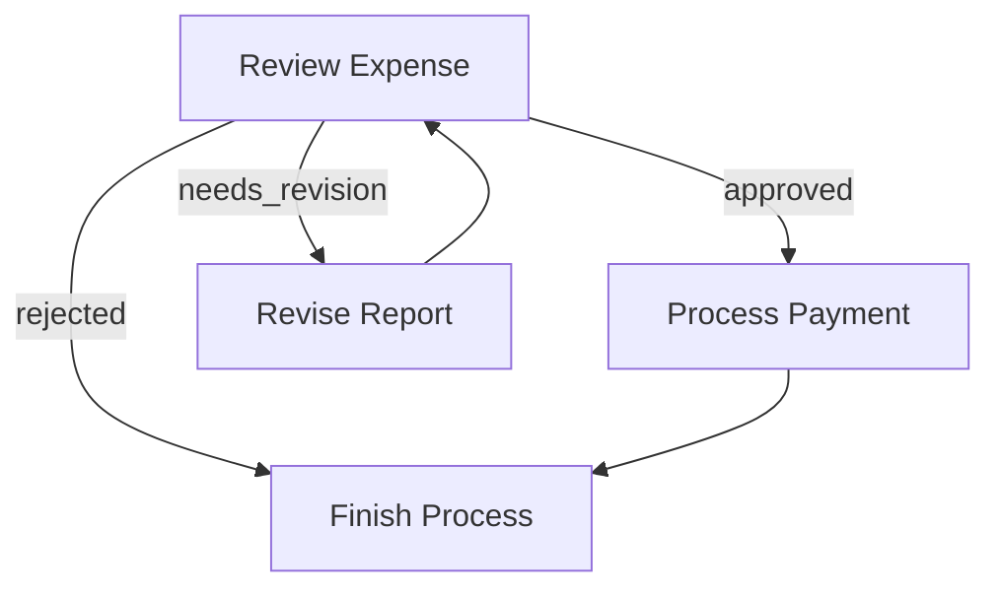
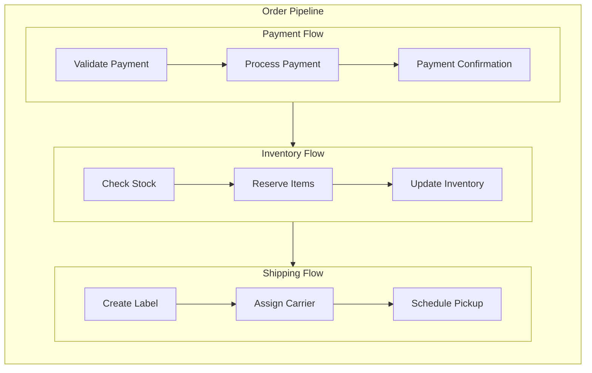

# 流

**流**编排了一个节点图。您可以按顺序链接节点，或根据每个节点的`post()`返回的**动作**创建分支。

## 1. 基于动作的转换

每个节点的`post()`返回一个**动作**字符串。默认情况下，如果`post()`不返回任何内容，我们将其视为`"default"`。

您可以使用以下语法定义转换:

1. **基本默认转换**: `node_a >> node_b`
  这意味着如果`node_a.post()`返回`"default"`，则转到`node_b`。
  (等同于`node_a - "default" >> node_b`)

2. **命名动作转换**: `node_a - "action_name" >> node_b`
  这意味着如果`node_a.post()`返回`"action_name"`，则转到`node_b`。

可以创建循环、分支或多步骤流。

## 2. 创建流

**流**从一个**起始**节点开始。您调用`Flow(start=some_node)`来指定入口点。当您调用`flow.run(shared)`时，它会执行起始节点，查看其从`post()`返回的动作，遵循转换，并继续直到没有下一个节点。

### 示例: 简单序列

这是一个由两个节点组成的最小流:

```python
node_a >> node_b
flow = Flow(start=node_a)
flow.run(shared)
```

- 当您运行流时，它会执行`node_a`。
- 假设`node_a.post()`返回`"default"`。
- 然后流会看到`"default"`动作链接到`node_b`并运行`node_b`。
- `node_b.post()`返回`"default"`，但我们没有定义`node_b >> something_else`。所以流在那里结束。

### 示例: 分支与循环

这是一个简单的费用审批流，演示了分支和循环。`ReviewExpense`节点可以返回三种可能的动作:

- `"approved"`: 费用已批准，进入支付处理
- `"needs_revision"`: 费用需要修改，发回修订
- `"rejected"`: 费用被拒绝，结束流程

我们可以这样连接它们:

```python
# Define the flow connections
review - "approved" >> payment        # If approved, process payment
review - "needs_revision" >> revise   # If needs changes, go to revision
review - "rejected" >> finish         # If rejected, finish the process

revise >> review   # After revision, go back for another review
payment >> finish  # After payment, finish the process

flow = Flow(start=review)
```

让我们看看它是如何流动的:

1. 如果`review.post()`返回`"approved"`，费用将移动到`payment`节点
2. 如果`review.post()`返回`"needs_revision"`，它将转到`revise`节点，然后循环回`review`
3. 如果`review.post()`返回`"rejected"`，它将移动到`finish`节点并停止



### 运行单个节点与运行流

- `node.run(shared)`: 只运行该节点(调用`prep->exec->post()`)，返回一个动作。
- `flow.run(shared)`: 从起始节点开始执行，遵循动作到下一个节点，依此类推，直到流无法继续。

> `node.run(shared)`**不会**继续到后续节点。
> 这主要用于调试或测试单个节点。
> 
> 在生产环境中始终使用`flow.run(...)`以确保整个管道正确运行。
{: .warning }

## 3. 嵌套流

**流**可以像节点一样工作，这使得强大的组合模式成为可能。这意味着您可以:

1. 在另一个流的转换中使用流作为节点。
2. 将多个较小的流组合成一个较大的流以供重用。
3. 节点`params`将是**所有**父级`params`的合并。

### 流的节点方法

**流**也是一个**节点**，因此它将运行`prep()`和`post()`。但是:

- 它**不会**运行`exec()`，因为它的主要逻辑是编排其节点。
- `post()`总是接收`None`作为`exec_res`，而应该从共享存储中获取流执行结果。

### 基本流嵌套

以下是如何将一个流连接到另一个节点:

```python
# 创建一个子流
node_a >> node_b
subflow = Flow(start=node_a)

# 将其连接到另一个节点
subflow >> node_c

# 创建父流
parent_flow = Flow(start=subflow)
```

当`parent_flow.run()`执行时:
1. 它启动`subflow`
2. `subflow`运行其节点(`node_a->node_b`)
3. `subflow`完成后，执行继续到`node_c`

### 示例: 订单处理管道

这是一个将订单处理分解为嵌套流的实际示例:

```python
# 支付处理子流
validate_payment >> process_payment >> payment_confirmation
payment_flow = Flow(start=validate_payment)

# 库存子流
check_stock >> reserve_items >> update_inventory
inventory_flow = Flow(start=check_stock)

# 运输子流
create_label >> assign_carrier >> schedule_pickup
shipping_flow = Flow(start=create_label)

# 将流连接到主订单管道
payment_flow >> inventory_flow >> shipping_flow

# 创建主流
order_pipeline = Flow(start=payment_flow)

# 运行整个管道
order_pipeline.run(shared_data)
```

这创建了清晰的关注点分离，同时保持了清晰的执行路径:

