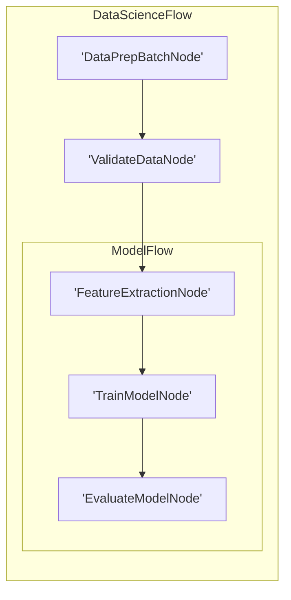

# 可视化与调试

与 LLM 封装器类似，我们**不**提供内置的可视化和调试功能。这里，我们推荐一些*最小化*（且不完整）的实现。这些示例可以作为您自己工具的起点。

## 1. 使用 Mermaid 进行可视化

此代码递归遍历嵌套图，为每个节点分配唯一 ID，并将 Flow 节点视为子图，以生成用于分层可视化的 Mermaid 语法。


```python
def build_mermaid(start):
    ids, visited, lines = {}, set(), ["graph LR"]
    ctr = 1
    def get_id(n):
        nonlocal ctr
        return ids[n] if n in ids else (ids.setdefault(n, f"N{ctr}"), (ctr := ctr + 1))[0]
    def link(a, b):
        lines.append(f"    {a} --> {b}")
    def walk(node, parent=None):
        if node in visited:
            return parent and link(parent, get_id(node))
        visited.add(node)
        if isinstance(node, Flow):
            node.start_node and parent and link(parent, get_id(node.start_node))
            lines.append(f"\n    subgraph sub_flow_{get_id(node)}[{type(node).__name__}]")
            node.start_node and walk(node.start_node)
            for nxt in node.successors.values():
                node.start_node and walk(nxt, get_id(node.start_node)) or (parent and link(parent, get_id(nxt))) or walk(nxt)
            lines.append("    end\n")
        else:
            lines.append(f"    {(nid := get_id(node))}['{type(node).__name__}']")
            parent and link(parent, nid)
            [walk(nxt, nid) for nxt in node.successors.values()]
    walk(start)
    return "\n".join(lines)
```



例如，假设我们有一个用于数据科学的复杂 Flow：

```python
class DataPrepBatchNode(BatchNode):
    def prep(self,shared): return []
class ValidateDataNode(Node): pass
class FeatureExtractionNode(Node): pass
class TrainModelNode(Node): pass
class EvaluateModelNode(Node): pass
class ModelFlow(Flow): pass
class DataScienceFlow(Flow):pass

feature_node = FeatureExtractionNode()
train_node = TrainModelNode()
evaluate_node = EvaluateModelNode()
feature_node >> train_node >> evaluate_node
model_flow = ModelFlow(start=feature_node)
data_prep_node = DataPrepBatchNode()
validate_node = ValidateDataNode()
data_prep_node >> validate_node >> model_flow
data_science_flow = DataScienceFlow(start=data_prep_node)
result = build_mermaid(start=data_science_flow)
```

该代码生成一个 Mermaid 图：



有关基于 d3.js 的可视化，请查看 [cookbook](https://github.com/The-Pocket/PocketFlow/tree/main/cookbook/pocketflow-visualization)。

## 2. 调用栈调试

打印节点调用栈对于调试很有用。这可以通过检查运行时调用栈来实现：

```python
import inspect

def get_node_call_stack():
    stack = inspect.stack()
    node_names = []
    seen_ids = set()
    for frame_info in stack[1:]:
        local_vars = frame_info.frame.f_locals
        if 'self' in local_vars:
            caller_self = local_vars['self']
            if isinstance(caller_self, BaseNode) and id(caller_self) not in seen_ids:
                seen_ids.add(id(caller_self))
                node_names.append(type(caller_self).__name__)
    return node_names
```

例如，假设我们有一个用于数据科学的复杂 Flow：

```python
class DataPrepBatchNode(BatchNode): 
    def prep(self, shared): return []
class ValidateDataNode(Node): pass
class FeatureExtractionNode(Node): pass
class TrainModelNode(Node): pass
class EvaluateModelNode(Node): 
    def prep(self, shared):
        stack = get_node_call_stack()
        print("Call stack:", stack)
class ModelFlow(Flow): pass
class DataScienceFlow(Flow):pass

feature_node = FeatureExtractionNode()
train_node = TrainModelNode()
evaluate_node = EvaluateModelNode()
feature_node >> train_node >> evaluate_node
model_flow = ModelFlow(start=feature_node)
data_prep_node = DataPrepBatchNode()
validate_node = ValidateDataNode()
data_prep_node >> validate_node >> model_flow
data_science_flow = DataScienceFlow(start=data_prep_node)
data_science_flow.run({})
```

输出将是：`Call stack: ['EvaluateModelNode', 'ModelFlow', 'DataScienceFlow']`